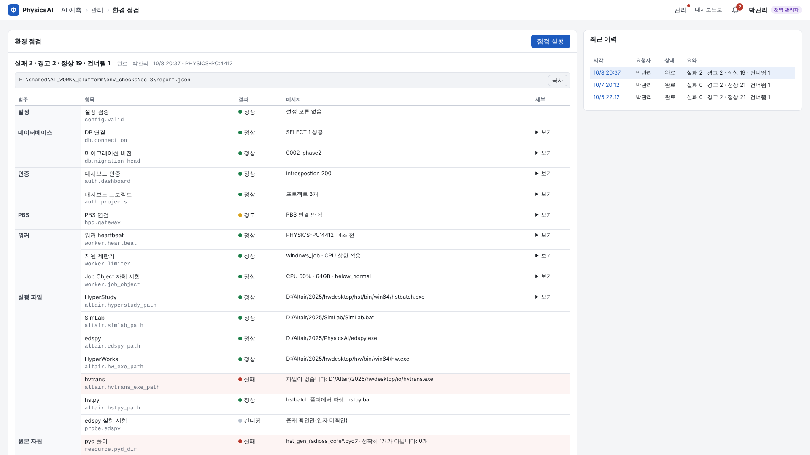

# PhysicsAI 플랫폼 관리자 매뉴얼

- 대상: 플랫폼을 설치·운영하는 서버 관리자, 전역 관리자(대시보드 `is_global_admin`)
- 기준: 저장소 `claude/ops` 브랜치(2026-10-09), 패키지 버전 `0.1.0`, DB migration head `0003_hpc_cancel_failed`
- 근거 문서: 계약 [platform.md](../contracts/platform.md)(1차), [phase2.md](../contracts/phase2.md)(2차, 우선), [결정 기록](../decisions.md), [E2E 체크리스트](../e2e-checklist.md). 이 매뉴얼과 계약이 다르면 계약이 우선이고, 계약과 코드가 다르면 부록 C에 적었다.
- 사용자용 설명은 [사용자 매뉴얼](user.md)을 본다.

> 배포 스크립트(`deploy/`)는 **실제 Windows에서 실행 검증되지 않았다**(phase2 §11). 첫 설치는 E2E 체크리스트 E2-0-3~E2-0-6을 함께 기록하면서 진행한다.

---

## 1. 구성 개요

### 1.1 구성 요소

| 구성 요소 | 실행 형태 | 역할 | 기본 위치·포트 |
|---|---|---|---|
| 프런트엔드 | 정적 파일(Vite build) | 화면. 기본 경로 `/physicsai/` | `<install_root>\frontend\dist`(= `deploy.json`의 `caddy_frontend_root`) |
| 백엔드(API) | `python -m physicsai_api.serve`(uvicorn) | 입력 검증·권한·작업 생성·조회. **외부 프로그램을 실행하지 않는다** | `127.0.0.1:8100`, 접두 `/physicsai/api` |
| 워커 | `python -m physicsai_worker` | 대기열 claim, Altair·PBS 명령 실행(Job Object 안), HPC 폴링·회수, 환경 점검 워커 항목, 알림 정리 | PC당 1개(잠금 파일 `worker.state_dir/physicsai-worker.lock`) |
| DB | PostgreSQL(대시보드 DB와 **별도** DB `physicsai`) | 작업·상태·경로·수치 요약. 파일 본문은 저장하지 않음 | `127.0.0.1:5432` |
| 산출물 | 파일 시스템 | Study 폴더(AI 루트 아래), 환경 점검 보고서(`_platform`) | `storage.ai_root` |

```text
브라우저 ── https://<대시보드 주소>/physicsai/…   (같은 origin → 대시보드 세션 쿠키가 함께 전송)
   │
Caddy(대시보드 것) ─┬─ /physicsai/api/*  → PhysicsAI 백엔드 127.0.0.1:8100
                    ├─ /physicsai/*      → PhysicsAI 프런트 정적 파일
                    └─ 그 밖             → 대시보드(기존)
PhysicsAI 백엔드 ── GET /api/auth/me, /api/projects ──▶ 대시보드 백엔드(루프백, 예 127.0.0.1:8000)
       │
PostgreSQL `physicsai`  ◀── claim/renew/release ──  physicsai_worker ── Job Object ── edspy·SimLab·hw·hvtrans·hstbatch·hstpy
                                                         └── qsub/qstat/qdel(PBS, 설정 시)
```

### 1.2 대시보드와의 관계

- **같은 Windows Server PC**에서 대시보드와 나란히 돈다. 대시보드 코드는 바꾸지 않는다. 대시보드 Caddyfile에 PhysicsAI용 `handle` 블록 2개만 추가한다(§2.6).
- **로그인 공유**: 사용자는 대시보드에서 로그인한다. 같은 주소(origin)이므로 쿠키 `analysis_canvas_session`이 `/physicsai/` 요청에도 붙고, PhysicsAI 백엔드는 이 토큰으로 대시보드 `GET /api/auth/me`를 호출해 사용자·역할을 확인한다(결과 30초 캐시). 로그아웃은 대시보드에서 한다. 토큰 값은 로그·DB에 남기지 않는다.
- **프로젝트**: Study는 대시보드 프로젝트 1개에 속한다. 프로젝트 목록은 대시보드 `GET /api/projects`에서 가져온다.
- **권한**: 대시보드 역할을 그대로 쓴다(DB에 역할을 복제하지 않음).

| 동작 | 허용 |
|---|---|
| 조회(모든 화면·로그·산출물) | 로그인한 모든 ACTIVE 사용자(프로젝트 비멤버 포함) |
| 실행(Study 생성, 작업 등록, Final 지정, 파라미터 세트 등록 등) | 그 프로젝트 역할 `power`·`admin` |
| 대기열 관리(순서 변경·취소), 남의 작업 재시도, 관리 조회(`/admin/*`), 환경 점검 | **전역 관리자**(`is_global_admin`) |
| 오류 묶음 받기 | 작업 등록자 본인 또는 전역 관리자 |

- 대시보드가 내려가면 PhysicsAI 화면은 503 `DASHBOARD_UNREACHABLE`가 된다(인증을 확인할 수 없음).

### 1.3 경로 `/physicsai/`

- 백엔드 라우트 접두 `/physicsai/api`와 프런트 base `/physicsai/`는 **코드에 고정**이다. `server.base_path`는 예약(미사용) 키라 써도 경로가 바뀌지 않고 경고만 나온다(§4.4).
- Caddy는 접두를 벗기지 않고 백엔드로 넘긴다(`/physicsai/api/*` 그대로). 프런트는 `uri strip_prefix /physicsai` 후 정적 파일을 준다.

---

## 2. 설치

### 2.1 준비물

| 항목 | 내용 |
|---|---|
| OS | Windows Server(대시보드와 같은 PC), 관리자 권한 PowerShell |
| Python | **3.13**(오프라인 설치본을 미리 설치. 경로는 `deploy.json`의 `python_exe`) |
| PostgreSQL | 16 기준, 이미 설치되어 있고 `postgres` 관리자 비밀번호를 알고 있음(`pg_bin`에 `psql.exe`) |
| Caddy | 대시보드가 쓰는 Caddy(설정 파일 수정 권한) |
| Altair 2026.1 | HyperStudy·SimLab·PhysicsAI(edspy)·HyperWorks(hw)·hvtrans 설치·라이선스 |
| 실행 계정 | `NT AUTHORITY\SYSTEM`이 아닌 지정 계정(예 `CORP\svc_physicsai`). AI 루트 읽기·쓰기, Altair 라이선스 접근 권한 |
| AI 루트 | 산출물 폴더(예 `E:/shared/AI_WORK`). **SPDM master 밖**, 경로에 공백·`& | < > ^ % ! "` 금지 |
| 원본 반입 자원 | 원본 앱 배포본의 런처·pyd·TCL·tpl 템플릿(§2.7, `deploy/RESOURCES.txt`) |
| 오프라인 묶음 | `physicsai-offline-<version>.zip`(§2.2) |

### 2.2 오프라인 묶음 만들기(인터넷 되는 준비 PC)

```powershell
# Windows 준비 PC
powershell -NoProfile -ExecutionPolicy Bypass -File deploy\collect-offline.ps1 -DryRun   # 실행할 명령만 확인
powershell -NoProfile -ExecutionPolicy Bypass -File deploy\collect-offline.ps1
```

```bash
# Linux 준비 PC
bash deploy/collect-offline.sh --dry-run
bash deploy/collect-offline.sh
```

- 하는 일: `deploy/requirements.lock` 기준 win_amd64·Python 3.13 wheel 내려받기 → 우리 패키지 wheel → `frontend`에서 `npm ci && npm run build` → `dist/{wheels, frontend, migrations, config, deploy}`를 `physicsai-offline-<version>.zip`으로 묶음.
- 원본 반입 자원(`resources.*`)은 묶지 않는다(라이선스·사내 배포물).

### 2.3 설치 매개변수 `deploy.json`

폐쇄망 PC에서 zip을 풀고 `deploy\deploy.example.json`을 같은 폴더에 `deploy.json`으로 복사해 고친다. **경로 문자열은 이 파일에만** 둔다.

| 키 | 의미 | 예시 |
|---|---|---|
| `install_root` | 설치 루트(venv·migrations·`_backup`) | `D:\physicsai` |
| `python_exe` | Python 3.13 실행 파일 | `D:\Python313\python.exe` |
| `pg_bin` | PostgreSQL bin 폴더(`psql.exe`) | `D:\PostgreSQL\16\bin` |
| `pg_host` / `pg_port` | DB 주소 | `127.0.0.1` / `5432` |
| `db_name` / `db_role` | 만들 DB·앱 역할 | `physicsai` / `physicsai_app` |
| `config_path` | 플랫폼 설정 파일 위치(머신 환경변수 `PHYSICSAI_CONFIG`가 됨) | `D:\physicsai\config\platform.yaml` |
| `service_user` | 작업 실행 계정 | `CORP\svc_physicsai` |
| `run_mode` | `Background`(로그온 무관, 세션 0) / `Interactive`(그 계정 로그온 세션) | `Background` |
| `caddy_frontend_root` | 프런트 정적 파일 배치 위치(Caddy `root`) | `D:\physicsai\frontend\dist` |

### 2.4 설치 실행

**권장 순서**: `config_path` 위치에 `platform.yaml`을 먼저 만들어 둔다(§4를 보고 `ai_root`·`altair.*`·`resources.*`·`profile: prod`를 채움). 설치 스크립트는 설정 파일이 없을 때만 예시를 복사하는데, 예시 값 그대로면 워커가 기동을 거부하고(종료코드 2) 작업 스케줄러가 1분마다 재시작을 반복한다.

```powershell
# 관리자 권한 PowerShell, 풀어 둔 묶음의 deploy 폴더에서
.\install.bat                       # 또는 .\install.ps1 [-ConfigFile .\deploy.json] [-ServiceUser CORP\svc] [-RunMode Interactive]
```

| 단계 | 내용 | 확인 |
|---|---|---|
| ① | 관리자 권한·Python 3.13 확인 | 아니면 중단 |
| ② | `<install_root>\venv` 생성, `pip install --no-index --find-links wheels physicsai-platform`, migrations 복사 | |
| ③ | 프런트를 `caddy_frontend_root`로 복사 | |
| ④ | `config_path`가 없으면 `platform.example.yaml` 복사(있으면 그대로) | 복사됐다면 값을 고친 뒤 작업 재시작 |
| ⑤ | DB 역할·DB가 **없을 때만** 생성. 비밀번호 2개(postgres 관리자, 앱 역할)를 화면 입력(`Read-Host -AsSecureString`)으로 받아 `PGPASSWORD` 프로세스 환경으로만 전달 | 역할 생성 SQL은 표준 입력으로, 그 세션의 문장 로그를 끈 뒤 실행(비밀번호가 서버 로그에 남지 않게) |
| ⑥ | 머신 환경변수 `PHYSICSAI_CONFIG`, `PHYSICSAI_DATABASE_URL` 설정(값은 출력하지 않음) | DB URL에 앱 비밀번호가 들어 있으므로 머신 환경변수 읽기 권한을 관리자로 제한 |
| ⑦ | `alembic upgrade head` | head = `0003_hpc_cancel_failed` |
| ⑧ | 작업 스케줄러 등록 `PhysicsAI-Backend`(`venv\Scripts\python.exe -m physicsai_api.serve`), `PhysicsAI-Worker`(`… -m physicsai_worker`), 작업 폴더 `install_root` | §2.5 |
| ⑨ | 두 작업 시작 → `http://127.0.0.1:<server.port>/physicsai/api/health`(포트는 `platform.yaml`의 `server.port`에서 읽음) 60초까지 확인 | `{"status":"ok"}` |
| ⑩ | Caddy 스니펫 위치·환경변수 안내 출력 | §2.6 |

주의
- `install.bat`·`update.bat`·시연 `start-demo.bat`·`stop-demo.bat`은 `PSModulePath`를 비우고 Windows PowerShell 5.1을 부른다 — PowerShell 7 창에서 실행해도 5.1 기본 모듈로 동작한다. `.ps1`을 직접 실행할 때는 Windows PowerShell 5.1 창을 쓴다.
- **재설치 시 앱 역할 비밀번호**: 역할이 이미 있으면 비밀번호를 바꾸지 않는다. 그런데 ⑥의 DB URL은 이번에 입력한 값으로 만든다 → 기존 역할 비밀번호와 **같은 값**을 입력해야 한다.
- `Background` 모드는 실행 계정 비밀번호를 한 번 더 묻는다(작업 등록용).

### 2.5 작업 스케줄러(서비스 대신)

NSSM·pywin32를 쓰지 않고 작업 스케줄러로 상시 실행한다(phase2 가정 A-14).

| 설정 | 값 | 이유 |
|---|---|---|
| 트리거 | `Background`: 부팅 시(`AtStartup`) / `Interactive`: 실행 계정 로그온 시(`AtLogOn`) | |
| 실행 시간 제한 | **0(무제한)** | 기본 72시간이면 장시간 작업 중 워커가 종료됨 |
| 실패 시 재시작 | 1분 간격, 999회 | 워커·백엔드 비정상 종료 복구 |
| 여러 인스턴스 | `IgnoreNew` | 워커 단일 인스턴스 잠금과 이중 보호 |
| 권한 수준 | `Limited` | |

- 수동 조작: `Start-ScheduledTask PhysicsAI-Worker`, `Stop-ScheduledTask PhysicsAI-Worker`(백엔드도 같음). 워커를 멈추면 Job Object `KILL_ON_JOB_CLOSE`로 실행 중인 Altair 프로세스 트리도 함께 끝나고, 그 작업은 약 1분(lease) 뒤 `INTERRUPTED`가 된다.
- **세션 0 주의**: `Background`는 데스크톱이 없는 세션 0에서 돈다. HyperWorks·SimLab 배치(특히 `hw -b`로 그림을 만드는 TCL)가 세션 0에서 동작하는지는 미확인(U11·U31). 안 되면 `-RunMode Interactive`로 다시 등록하고 실행 계정을 자동 로그온해 둔다(§13 FAQ).

### 2.6 Caddy 설정

`deploy\caddy\physicsai.caddy` 내용을 **대시보드 Caddyfile 사이트 블록 안, catch-all `handle` 앞**에 넣는다.

```caddyfile
redir /physicsai /physicsai/ 308

handle /physicsai/api/* {
	reverse_proxy 127.0.0.1:{$PHYSICSAI_PORT:8100}
}

handle /physicsai/* {
	root * {$PHYSICSAI_FRONTEND_ROOT}
	uri strip_prefix /physicsai
	try_files {path} /index.html
	file_server
}
```

- `{$…}`는 Caddy가 **설정을 읽을 때** 자기 프로세스 환경변수로 바꾼다. Caddy 실행 환경에 `PHYSICSAI_PORT`(= `server.port`), `PHYSICSAI_FRONTEND_ROOT`(= `caddy_frontend_root`)를 두거나 값을 직접 적는다. 바꾼 뒤 Caddy 설정을 다시 읽는다(`caddy reload` 등 대시보드 운영 방식대로).
- 대시보드의 `@api path /api /api/*`와 `/physicsai/api`는 겹치지 않는다.
- 확인: 운영 주소 `/physicsai/` 접속 → 대시보드 로그인 상태면 이름·역할이 보임(E2-0-5).

### 2.7 원본 반입 자원 배치

원본 앱 배포본에서 아래 파일을 서버 폴더(예 `D:/physicsai/resources/`)로 복사하고 `platform.yaml`의 `resources.*`에 절대경로(`/` 권장, 공백·메타문자 금지)를 적는다. 값이 비어 있으면 **그 기능만 비활성**("관리자 설정 필요: <키>")이다.

| 설정 키 | 원본 파일 | 쓰는 기능 |
|---|---|---|
| `preview_pred_h3d_tcl` | `CONFIG/BATCHRUN/BATCHRUN_preview_pred_h3d.tcl` | ④ 컨투어 미리보기(**prod 필수**) |
| `batchrun_dir` | `CONFIG/BATCHRUN/`(런처 `BATCHRUN_*.py`) | ①-1, ①-3, ⑤ |
| `pyd_dir` | `BUILD_PYD/`(`<core>*.pyd`, 코어마다 **정확히 1개**) | ①-1, ①-3, ⑤ |
| `simlab_tpl_template` | `CONFIG/TEMPLATE/TEMAPLATE_simlab_parametered_mesh.tpl` | ①-2 tpl 생성 |
| `doe_design_type_json` | `CONFIG/DATA/DATA_doe_design_type.json` | ①-3 DOE 유형 |
| `hypermesh_include_tcl` | `CONFIG/BATCHRUN/BATCHRUN_create_include_node_elem.tcl` | ①-3, ⑤ |
| `preview_h3d_tcl` | `CONFIG/BATCHRUN/BATCHRUN_preview_h3d.tcl` | ②-1 |
| `preview_hg_tcl` | `CONFIG/BATCHRUN/BATCHRUN_preview_hg.tcl` | ②-3 |
| `curate_hg_tcl` | `CONFIG/BATCHRUN/BATCHRUN_curate_hg.tcl` | ②-4 |
| `extract_minmax_tcl` | `H3D_StaticMinMax_to_CSV_FAST.tcl` | ⑤ |

- 플랫폼은 pyd를 import하거나 런처를 직접 실행하지 않는다. 작업 폴더로 복사한 뒤 SimLab·hstbatch·hstpy가 실행한다.
- 배치 후 "관리 > 환경 점검"으로 확인한다(§10).

### 2.8 DB 수동 생성(설치 스크립트 없이)

```sql
-- postgres 관리자로. 비밀번호가 서버 로그에 남지 않게 이 세션의 문장 로그를 끈다(superuser 세션)
SET log_statement = 'none'; SET log_min_error_statement = 'panic'; SET log_min_duration_statement = -1;
CREATE ROLE "physicsai_app" LOGIN PASSWORD '<비밀번호>';
CREATE DATABASE "physicsai" OWNER "physicsai_app";
```

```powershell
$env:PHYSICSAI_DATABASE_URL = 'postgresql+psycopg://physicsai_app:<URL 인코딩 비밀번호>@127.0.0.1:5432/physicsai'
$env:PHYSICSAI_CONFIG = 'D:\physicsai\config\platform.yaml'
D:\physicsai\venv\Scripts\python.exe -m alembic -c D:\physicsai\migrations\alembic.ini upgrade head
```

- downgrade는 지원하지 않는다(데이터 보호, `RuntimeError`). 되돌리려면 DB 백업에서 복원한다(§3.3).

### 2.9 개발 실행(참고)

설치 없이 저장소에서 돌릴 때(계약 platform.md §4.6). `.ps1`/`.sh` 쌍.

| 스크립트 | 동작 |
|---|---|
| `scripts/dev-db-init` | `PHYSICSAI_DATABASE_URL` DB에 `alembic upgrade head` |
| `scripts/dev-backend` | `python -m physicsai_api.serve`(설정 `server.host`·`port`) |
| `scripts/dev-worker` | `python -m physicsai_worker` |
| `scripts/dev-frontend` | Vite `127.0.0.1:5174/physicsai/`, `/physicsai/api` → `127.0.0.1:8100` 프록시 |
| `scripts/test-all` | 백엔드·워커 pytest + 프런트 vitest + 타입 검사 |

개발 로그인: 대시보드 dev(`127.0.0.1:5173`)에 먼저 로그인한다. 호스트 이름은 둘 다 `127.0.0.1`로 맞춘다(`localhost`와 섞지 않음). 대시보드 없이 하려면 `auth.mode: dev_static`(profile dev + 127.0.0.1 바인딩에서만 허용).

---

## 3. 업데이트·제거·백업

### 3.1 업데이트

```powershell
# 관리자 권한 PowerShell, 새 묶음의 deploy 폴더(기존 deploy.json을 복사해 둔다)
.\update.bat              # 또는 .\update.ps1 [-Force]
```

| 단계 | 내용 |
|---|---|
| ① | 대기·실행 중 작업과 진행 중 환경 점검이 있는지 확인. 대시보드 세션 토큰을 입력하면 `GET /physicsai/api/queue`(관리자 토큰이면 환경 점검도)로, Enter만 누르면 머신 환경변수 DB URL로 `psql` 직접 조회. 1건 이상이면 **중단**(`-Force`면 경고 후 진행 → 실행 중 작업은 `INTERRUPTED`) |
| ② | 작업 2개 중지 |
| ③ | 기존 `venv`·`migrations`·프런트를 `<install_root>\_backup\<UTC yyyyMMddTHHmmssZ>\`로 **이동**(삭제 없음) |
| ④ | 새 venv·wheel·migrations·프런트 배치 |
| ⑤ | `alembic upgrade head` |
| ⑥ | 시작·health 확인 |
| ⑦ | 실패하면 되돌리는 방법을 출력(자동 되돌림 없음) |

- `platform.yaml`과 `deploy.json`은 건드리지 않는다. 새 버전에 설정 키가 추가됐으면 새 `config/platform.example.yaml`과 비교해 직접 반영한다(알 수 없는 키·누락된 1차 확정 템플릿은 설정 오류).
- 되돌리기: 작업 중지 → 새 `venv`·`migrations`·프런트를 다른 이름으로 옮김 → `_backup\<UTC>`의 `venv`·`migrations`·`frontend_dist`를 원래 위치로 이동 → 작업 시작. migration이 이미 올라갔으면 DB는 백업에서 복원해야 한다.
- 업데이트 전 DB 백업(§3.3)을 먼저 한다.

### 3.2 제거

```powershell
.\uninstall-tasks.ps1     # 작업 스케줄러 등록 해제만(파일·DB·환경변수는 그대로)
```

완전 제거가 필요하면 관리자가 직접(되돌릴 수 없으니 백업 후):
1. 대시보드 Caddyfile에서 PhysicsAI 스니펫 삭제 → Caddy 다시 읽기
2. 머신 환경변수 `PHYSICSAI_CONFIG`, `PHYSICSAI_DATABASE_URL` 삭제
3. DB `physicsai`·역할 `physicsai_app` 삭제(`pg_dump` 백업 후)
4. `install_root` 폴더 정리
5. **AI 루트의 Study 폴더는 사용자 산출물**이다. 플랫폼은 어떤 경우에도 지우지 않는다. 정리 여부는 사용자와 합의한다.

### 3.3 백업·복원

| 대상 | 방법 | 주기(권장) |
|---|---|---|
| DB `physicsai` | `pg_dump -Fc`(아래) | 매일 + 업데이트 직전 |
| AI 루트(`storage.ai_root`) | 사내 파일 백업(Study 폴더, `_platform`) | 사내 정책 |
| 설정 | `platform.yaml`, `deploy.json` 사본 | 변경 시 |
| 원본 반입 자원 | `resources.*` 폴더 사본 | 반입 시 |

```powershell
$pg = 'D:\PostgreSQL\16\bin'
$s = Read-Host -AsSecureString 'physicsai_app 비밀번호'
$env:PGPASSWORD = [Runtime.InteropServices.Marshal]::PtrToStringBSTR([Runtime.InteropServices.Marshal]::SecureStringToBSTR($s))
& "$pg\pg_dump.exe" -h 127.0.0.1 -U physicsai_app -Fc -f "D:\backup\physicsai_$(Get-Date -Format yyyyMMdd).dump" physicsai
$env:PGPASSWORD = $null
# 복원(작업 2개 중지 후): pg_restore -h 127.0.0.1 -U physicsai_app -d physicsai --clean --if-exists <파일>
```

- DB에는 경로·상태·수치만 있고 파일은 AI 루트에 있다. 복원할 때는 **DB와 AI 루트를 같은 시점**으로 맞춘다(한쪽만 복원하면 "파일 없음"·sha256 불일치 `INPUT_CHANGED`가 난다).
- 비밀번호는 명령 인자에 넣지 않는다(위처럼 프로세스 환경변수로만).
- 플랫폼은 덮어쓸 산출물을 `<study>/_backup/<UTC>_<job_id>/`로 옮기고 **자동 삭제하지 않는다**. 디스크가 차면 관리자가 사용자와 확인 후 정리한다(자동 용량 정리는 보류 결정, decisions 2026-10-09).

---

## 4. 설정 파일 레퍼런스

### 4.1 위치·우선순위·검증

- 파일: 환경변수 `PHYSICSAI_CONFIG`(설치 시 머신 범위로 설정), 없으면 `config/platform.yaml`. 예시는 `config/platform.example.yaml`.
- 환경변수 우선: `PHYSICSAI_PROFILE` > `profile`, `PHYSICSAI_HPC_GATEWAY` > `hpc.gateway`. DB 비밀번호는 설정 파일에 넣지 않고 `database.url_env`가 가리키는 환경변수에서 읽는다.
- **알 수 없는 키는 오류**(오타 방지). 오류가 있으면 백엔드는 뜨지만 쓰기 API가 503 `CONFIG_INVALID`, 워커는 기동을 거부(종료코드 2)하거나 실행 중이면 새 작업 claim을 멈춘다. 오류 키는 `/status`와 환경 점검 `config.valid`에 나온다.
- **생략한 키는 아래 "코드 기본값"**이 된다. 명령 템플릿처럼 코드 기본값이 null인 키를 빼면 오류가 아니라 **그 기능만 비활성**이다(§4.4). 예시 파일 전체를 복사해서 고치는 방식을 권장한다.
- 기동은 막지 않는 안내(예약 키 사용, 키 누락으로 비활성된 기능)는 `/status`의 `config.warnings`에 키 이름으로 나온다.
- 경로: `/` 구분자 권장. `ai_root`·`allowed_import_roots`·`resources.*`·`collect_root_*`에는 공백·제어문자·`& | < > ^ % ! "` 금지. `storage.spdm_roots`와 겹치면(같거나 안팎) 오류.

### 4.2 반영 시점

백엔드는 **기동 시 1번** 설정을 읽는다. 워커는 claim 주기(기본 2초)마다 파일 sha256을 보고 바뀌었으면 다시 읽어 검증한다(통과 → 새 값 적용, 실패 → 새 claim 중지). 실행 중 step은 이전 값으로 끝까지 간다.

| 표기 | 뜻 |
|---|---|
| **B** | 백엔드 재시작 필요(`Stop/Start-ScheduledTask PhysicsAI-Backend`). 워커는 자동 재적용 |
| **W** | 워커만 쓰는 값. 자동 재적용(재시작 불필요) |
| **W↻** | 워커 재시작 필요 |
| **B+W↻** | 백엔드·워커 모두 재시작 |

헷갈리면 대기열이 빈 시간에 둘 다 재시작한다.

### 4.3 키 표

#### 최상위·server·database

| 키 | 의미 | 코드 기본값 | 예시 값 | 반영 |
|---|---|---|---|---|
| `schema_version` | 설정 스키마 버전(1만 허용) | `1` | `1` | B+W↻ |
| `profile` | `dev`\|`prod`. prod면 `altair.*`·`resources.*` 파일 존재 검사, `preview_pred_h3d_tcl` 필수, `worker.limiter: null`·`auth.mode: dev_static` 금지 | `dev` | `dev`(운영은 `prod`) | B+W↻ |
| `server.host` | 백엔드 바인딩 주소(Caddy 뒤이므로 `127.0.0.1`) | `127.0.0.1` | `127.0.0.1` | B |
| `server.port` | 백엔드 포트. **포트의 유일한 출처**(설치·업데이트 스크립트의 health 확인도 이 값을 읽음). Caddy `PHYSICSAI_PORT`와 일치 | `8100` | `8100` | B |
| `server.base_path` | **예약(미사용)**. 경로는 `/physicsai` 고정. 값이 있으면 경고 `config.warnings`(지워도 됨) | `/physicsai` | (예시에서 제거됨) | – |
| `database.url_env` | DB URL을 담은 환경변수 이름 | `PHYSICSAI_DATABASE_URL` | 같음 | B+W↻ |
| `database.pool_size` | DB 연결 풀 크기 | `5` | `5` | B+W↻ |

#### auth

| 키 | 의미 | 코드 기본값 | 예시 값 | 반영 |
|---|---|---|---|---|
| `auth.mode` | `dashboard`(운영) \| `dev_static`(개발 전용) \| `demo`(시연 모드 전용, `demo.enabled: true`일 때만 — §14) | `dashboard` | `dashboard` | B |
| `auth.dashboard_internal_url` | 대시보드 백엔드 루프백 주소(`http(s)://호스트[:포트]`) | `http://127.0.0.1:8000` | 같음 | B |
| `auth.dashboard_public_login_url` | 로그인 안내 링크(브라우저 기준) | `/` | `/` | B |
| `auth.cookie_name` | 대시보드 세션 쿠키 이름(대시보드와 같아야 함, D2) | `analysis_canvas_session` | 같음 | B |
| `auth.introspection_path` | 세션 확인 API | `/api/auth/me` | 같음 | B |
| `auth.projects_path` | 프로젝트 목록 API | `/api/projects` | 같음 | B |
| `auth.cache_ttl_s` | 세션 확인 캐시(초). 역할 변경이 반영되기까지 최대 이 시간 | `30` | `30` | B |
| `auth.timeout_s` | 대시보드 호출 타임아웃(초) | `3` | `3` | B |
| `auth.dev_static_principal.user_id` | dev_static 고정 사용자 id | `dev-admin` | 같음 | B |
| `auth.dev_static_principal.username` | 〃 이름 | `dev` | 같음 | B |
| `auth.dev_static_principal.display_name` | 〃 표시명 | `개발자` | 같음 | B |
| `auth.dev_static_principal.is_global_admin` | 〃 전역 관리자 여부 | `true` | `true` | B |
| `auth.dev_static_principal.memberships` | 〃 `[{project_id, role}]`(role `general`\|`power`\|`admin`) | `[]` | `[]` | B |

#### storage

| 키 | 의미 | 코드 기본값 | 예시 값 | 반영 |
|---|---|---|---|---|
| `storage.ai_root` | 산출물 유일 루트. 절대경로·존재·쓰기 가능·공백/메타 없음·SPDM과 비중첩 | `""`(오류) | `E:/shared/AI_WORK` | B |
| `storage.allowed_import_roots` | ③-4 모델 폴더·①-1 CAD·①-3 조립 폴더·①-5 결과 폴더를 추가로 읽을 수 있는 루트(읽기 전용) | `[]` | `[]`(예 `["F:/hpc_results"]`) | B |
| `storage.spdm_roots` | SPDM master 루트. 이 하위는 **쓰기 금지**, ②-0 가져오기만 읽기 허용. 비면 SPDM 가져오기 비활성 | `[]` | `[]` | B |

#### altair(실행 파일 — 경로는 여기서만)

| 키 | 의미 | 코드 기본값 | 예시 값 | 반영 |
|---|---|---|---|---|
| `altair.version_label` | 환경 스냅샷 표시용 버전 | `""` | `2026.1` | B |
| `altair.hyperstudy_path` | `{hstbatch}` — `hstbatch.exe` | `""` | `C:/Program Files/Altair/2026.1/hwdesktop/hst/bin/win64/hstbatch.exe` | B |
| `altair.simlab_path` | `{simlab}` — `SimLab.bat` | `""` | `…/SimLab/bin/win64/SimLab.bat` | B |
| `altair.edspy_path` | `{edspy}` — `edspy.bat` | `""` | `…/common/eds/win64/bin/win64/edspy.bat` | B |
| `altair.hw_exe_path` | `{hw}` — `hw.exe` | `""` | `…/hwdesktop/hw/bin/win64/hw.exe` | B |
| `altair.hvtrans_exe_path` | `{hvtrans}` — `hvtrans.exe` | `""` | `…/hwdesktop/io/result_readers/bin/win64/hvtrans.exe` | B |
| `altair.hstpy_path` | `{hstpy}`. 비면 `hyperstudy_path` 폴더의 `hstpy.bat` | `""` | `""` | B |
| `altair.altair_home` | ⑤ 실행 env `ALTAIR_HOME`. 비면 hstpy 폴더의 `../../..` | `""` | `""` | B |

빈 값은 오류가 아니다(그 실행 파일을 쓰는 step만 `EXECUTABLE_MISSING`). 값이 있으면 절대경로, prod면 파일이 있어야 한다. 실행 파일 경로에는 공백 허용(argv[0]만).

#### resources

| 키 | 의미 | 코드 기본값 | 예시 값 | 반영 |
|---|---|---|---|---|
| `resources.preview_pred_h3d_tcl` | ④ 컨투어 미리보기 TCL(prod 필수) | `""` | `D:/physicsai/resources/BATCHRUN/BATCHRUN_preview_pred_h3d.tcl` | B |
| `resources.batchrun_dir` | 런처 폴더 | `""` | `D:/physicsai/resources/BATCHRUN` | B |
| `resources.pyd_dir` | pyd 코어 폴더 | `""` | `D:/physicsai/resources/BUILD_PYD` | B |
| `resources.simlab_tpl_template` | ①-2 원본 tpl 템플릿 | `""` | `…/TEMPLATE/TEMAPLATE_simlab_parametered_mesh.tpl` | B |
| `resources.doe_design_type_json` | ①-3 DOE 유형 정의 | `""` | `…/DATA/DATA_doe_design_type.json` | B |
| `resources.hypermesh_include_tcl` | ①-3·⑤ include TCL | `""` | `…/BATCHRUN/BATCHRUN_create_include_node_elem.tcl` | B |
| `resources.preview_h3d_tcl` | ②-1 h3d 미리보기 TCL | `""` | `…/BATCHRUN/BATCHRUN_preview_h3d.tcl` | B |
| `resources.preview_hg_tcl` | ②-3 T01 미리보기 TCL | `""` | `…/BATCHRUN/BATCHRUN_preview_hg.tcl` | B |
| `resources.curate_hg_tcl` | ②-4 곡선 추출 TCL | `""` | `…/BATCHRUN/BATCHRUN_curate_hg.tcl` | B |
| `resources.extract_minmax_tcl` | ⑤ 응답 추출 TCL | `""` | `…/BATCHRUN/H3D_StaticMinMax_to_CSV_FAST.tcl` | B |
| `resources.launchers.extract_params.script` / `.core` | ①-1 런처 파일 이름 / pyd 코어 이름 | `BATCHRUN_get_parameter_from_cad.py` / `get_parameter_from_cad_core` | 같음 | B |
| `resources.launchers.gen_radioss.script` / `.core` | ①-3 〃 | `BATCHRUN_hst_gen_radioss_input.py` / `hst_gen_radioss_core` | 같음 | B |
| `resources.launchers.optimization.script` / `.core` | ⑤ 〃 | `BATCHRUN_hst_physicsai_optimization.py` / `hst_physicsai_optimization_core` | 같음 | B |

`script`는 파일 이름만(경로 구분자 없이 `.py`), `core`는 `^[A-Za-z_][A-Za-z0-9_]*$`. 런처 키는 위 3개만 허용.

#### worker(자원 제한·주기)

| 키 | 의미 | 코드 기본값 | 예시 값 | 반영 |
|---|---|---|---|---|
| `worker.limiter` | `auto`(Windows → `windows_job`, 그 외 `posix`) \| `windows_job` \| `posix` \| `null`(dev만) | `auto` | `auto` | W↻ |
| `worker.max_logical_cores` | CPU 상한 코어 수(1~1024) | `32` | `32` | B |
| `worker.max_memory_gb` | Job 메모리 상한 GB(1~4096) | `64` | `64` | B |
| `worker.priority` | `idle`\|`below_normal`\|`normal` | `below_normal` | `below_normal` | B |
| `worker.auto_detect` | true면 `min(설정값, 감지값 × ratio)` | `false` | `false` | B |
| `worker.auto_detect_ratio` | 자동 감지 비율(0.1~1.0) | `0.7` | `0.7` | B |
| `worker.posix_rlimit_as` | Linux 제한기에서 RLIMIT_AS 메모리 상한 적용 | `false` | `false` | W |
| `worker.heartbeat_interval_s` | 하트비트·lease 갱신 주기(초). 워커 온라인 판정 = 3배 이내 | `10` | `10` | B |
| `worker.lease_ttl_s` | 작업 lease 유효 시간(초, ≥ 3×heartbeat). 워커가 죽으면 이 시간 뒤 `INTERRUPTED` | `60` | `60` | W |
| `worker.claim_interval_s` | 대기열 확인 주기(초) | `2` | `2` | W |
| `worker.cancel_check_interval_s` | 취소 요청 확인 주기(초) | `2` | `2` | W |
| `worker.resource_sample_interval_s` | CPU·RAM·GPU 표본 주기(초) | `10` | `10` | W |
| `worker.env_passthrough` | Altair 자식 프로세스에 추가로 넘길 환경변수 이름 패턴(fnmatch). DB URL·`PHYSICSAI_*`·`*PASSWORD*`·`*SECRET*`·`*TOKEN*`·`PG*`는 항상 제외 | `[]` | `[]` | W |
| `worker.state_dir` | 단일 인스턴스 잠금 파일 폴더(상대경로면 작업 폴더 = `install_root` 기준) | `./state` | `./state` | W↻ |
| `worker.gpu_query` | GPU 조회 argv(`nvidia-smi --query-gpu=name,utilization.gpu,memory.used,memory.total --format=csv,noheader,nounits` 형식). null이면 GPU 표시 없음 | `null` | `["C:/Windows/System32/nvidia-smi.exe", …]` | W |

실행 시간 한도 키는 의도적으로 없다(오래 걸리면 관리자가 취소).

기본 전달 환경변수(허용목록): `SystemRoot`·`windir`·`ComSpec`·`PATH`·`PATHEXT`·`TEMP`·`TMP`·`USERPROFILE`·`HOME`·`APPDATA`·`LOCALAPPDATA`·`PROGRAMDATA`·`USERNAME`·`COMPUTERNAME`·`NUMBER_OF_PROCESSORS` 등 + `ALTAIR_*`·`*_LICENSE_*`·`*_LICENSE`·`EDS_*`·`CUDA_VISIBLE_DEVICES`(PBS 명령은 `PBS_*` 추가). 라이선스 변수 이름이 이 패턴에 안 맞으면 `env_passthrough`에 추가한다.

#### dataset·package·training_log·score·param_set(③④)

| 키 | 의미 | 코드 기본값 | 예시 값 | 반영 |
|---|---|---|---|---|
| `dataset.holdout_ratio` | 평가용 홀드아웃 비율 기본(0.05~0.5) | `0.1` | `0.1` | B |
| `dataset.seed` | 분할 seed 기본 | `20261008` | `20261008` | B |
| `dataset.split_group` | `file`(파일 단위) \| `parent_dir`(상위 폴더 = run 단위). run당 h3d가 여러 개면 `parent_dir` 권장(U12) | `file` | `file` | B |
| `dataset.min_h3d_files` | 최소 h3d 개수(≥2) | `2` | `2` | B |
| `dataset.min_psdata_bytes` | psdata 최소 크기(원본 검사 1 MiB) | `1048576` | `1048576` | W |
| `dataset.options_default.extract_faces` | 데이터셋 추출 옵션 기본 | `true` | `true` | B |
| `dataset.options_default.extract_mdi` | 〃 | `false` | `false` | B |
| `dataset.options_default.extract_time_history_vectors` | 〃 | `false` | `false` | B |
| `package.link_mode` | ③-2 `hardlink_or_copy`(같은 볼륨이면 하드링크) \| `copy`. HPC가 공유폴더로 하드링크를 못 읽으면 `copy`(U15) | `hardlink_or_copy` | 같음 | W |
| `training_log.log_globs` | ③-4 모델 폴더에서 학습 로그 후보 | `["*.log", "*.txt"]` | 같음 | B |
| `training_log.max_curve_points` | loss 곡선 저장 점 수 상한(≥3) | `2000` | `2000` | W |
| `training_log.parsers` | loss 파서 목록 `[{name, pattern}]`(§5.6) | 원본 `physicsai_default` 1개 | 같음 | W |
| `score.write_files` | true면 평가에 `--write-files`(`@write_files`) | `false` | `false` | W |
| `score.parsers` | 점수 파서 `[{name, pattern}]`(§5.6). 비면 "점수 형식 미확인"(U6) | `[]` | `[]` | W |
| `param_set.max_samples` | samples.csv 행 상한 | `20000` | `20000` | B |
| `param_set.max_total_bytes` | 파라미터 세트 폴더 총량 상한 | `2147483648`(2 GiB) | 같음 | B |

#### predict(④)

| 키 | 의미 | 코드 기본값 | 예시 값 | 반영 |
|---|---|---|---|---|
| `predict.rendered_script_name` | tpl 렌더 결과 파일 이름(`P/geom/` 아래). 파일 이름만 | `simlab_parametered_mesh.py` | 같음(U2) | W |
| `predict.mesh_output_glob` | SimLab이 `P/geom/` **직계**에 만든 메시 파일 패턴 → `P/INPUT/`로 복사 | `eps_mesh*` | 같음(U3) | W |
| `predict.starter_glob` | Radioss starter 패턴(조립 폴더·INPUT에서 정확히 1개) | `*_0000.rad` | 같음 | B |
| `predict.integer_rounding` | tpl 정수 형식(`%3i`) 반영 규칙 `half_up`\|`truncate`(U9) | `half_up` | `half_up` | B |
| `predict.env` | edspy 예측 추가 환경변수 | `{EDS_TNS_ACTVN_CHCKPT: "1"}` | 같음 | W |

#### commands(명령 템플릿 — §5 참고)

| 키 | step | 코드 기본값 | 예시 값(원본 인용) | 반영 |
|---|---|---|---|---|
| `commands.edspy_create_dataset` | ③-1 데이터셋 생성 | null(**1차 확정 → null이면 설정 오류**) | `["{edspy}", "--physicsai", "--create-dataset", "{out_psdata}", "--spec", "{spec_yaml}"]` | B |
| `commands.edspy_score` | ③-5 평가 | null(오류) | `["{edspy}", "--physicsai", "--score", "{score_path}", "--model", "{model_psmdl}", "--dataset", "{eval_psdata}", "@write_files"]` | B |
| `commands.geom_update` | ④ 형상 갱신 | null(→ 예측 작업 생성 409 `TEMPLATE_NOT_CONFIGURED`) | `["{simlab}", "-auto", "{rendered_script}", "-nographics"]`(U2) | B |
| `commands.mesh` | ④ 메싱 | null(→ SKIPPED) | `null`(U2) | B |
| `commands.rad_assemble` | ④ .rad 조립 후처리 | null(→ 복사 규칙만) | `null`(U3) | B |
| `commands.edspy_predict` | ④ 예측 | null(오류) | `["@cmd_c", "{edspy}", "--physicsai", "--predict-write", "{pred_h3d}", "--model", "{model_psmdl}", "--input-file", "{starter}", "@hooks_arg"]` | B |
| `commands.contour_preview` | ④ 컨투어 미리보기 | null(오류) | `["{hw}", "-clientconfig", "hwpost.dat", "-b", "-tcl", "{preview_tcl}", "-input", "{pred_h3d_fwd}", "-output", "{preview_json_fwd}"]` | B |
| `commands.response_extract` | ④ 응답 추출, ④ PBS 검증, ①-6 | null(→ SKIPPED, "추출 미구성") | `null`(U8·U35) | B |
| `commands.simlab_extract_params` | ①-1 | null(→ 기능 비활성) | `["{simlab}", "-auto", "{launcher}", "{cad_file}", "{xml_out}", "-nographics"]` | B |
| `commands.hst_gen_radioss` | ①-3 | null(비활성) | `["{hstbatch}", "-multiexec", "{multi_execution}", "-pyfile", "{launcher}"]` | B |
| `commands.h3d_preview` | ②-1 | null(비활성) | `["{hw}", "-clientconfig", "hwpost.dat", "-b", "-tcl", "{preview_tcl}", "-h3d", "{h3d}", "-result", "{result_json}"]` | B |
| `commands.hvtrans_curate` | ②-2 | null(비활성) | `["{hvtrans}", "-c", "{cfg}", "{h3d}", "{h3d}", "-o", "{out_h3d}", "-z0"]` | B |
| `commands.t01_preview` | ②-3 | null(비활성) | `["{hw}", "-clientconfig", "hwplot.dat", "-b", "-c", "-tcl", "{preview_tcl}", "-input", "{t01}", "-output", "{result_json}"]` | B |
| `commands.t01_curve_export` | ②-4 | null(비활성) | `["{hw}", "-clientconfig", "hwplot.dat", "-b", "-c", "-tcl", "{curate_tcl}", "-config", "{config_json}"]` | B |
| `commands.hst_optimization` | ⑤ | null(비활성) | `["@cmd_c", "{hstpy}", "{launcher}"]` | B |
| `commands_log_error_patterns` | **edspy step**(`edspy_create_dataset`·`edspy_score`·`edspy_predict`) 로그 오류 정규식(대소문자 무시, 줄 단위). 일치하면 종료코드 0이어도 `LOG_ERROR_DETECTED`. SimLab·hw step에는 적용하지 않음 | 원본 3개 | `'^\s*\d+\s+Error\s*:'`, `'Traceback \(most recent call last\):'`, `'^\s*\[ERROR\]'` | W |

#### hpc(PBS)

| 키 | 의미 | 코드 기본값 | 예시 값 | 반영 |
|---|---|---|---|---|
| `hpc.gateway` | `none`(PBS 기능 비활성) \| `command` \| `adapter`(자리만, 항상 미구성) | `none` | `none` | B |
| `hpc.poll_interval_s` | PBS 상태 조회 주기(초) | `60` | `60` | W |
| `hpc.lost_after_polls` | UNKNOWN 연속 이 횟수면 그 run `LOST`(실패) | `10` | `10` | W |
| `hpc.max_unreachable_minutes` | PBS 명령 연속 실패가 이 시간을 넘으면 작업 `HPC_UNREACHABLE` 실패 | `1440` | `1440` | W |
| `hpc.defaults.queue` / `.ncpus` / `.walltime` | 제출 기본값(화면 "고급"에서 바꿀 수 있음). 템플릿에 `{queue}`가 있는데 null이면 제출 실패 | `workq` / `16` / `24:00:00` | 같음 | B |
| `hpc.command.allowed_executables` | PBS 명령으로 허용할 실행 파일 절대경로 목록(`.bat`·`.cmd`·`.ps1` 금지) | `[]` | qsub/qstat/qdel `.exe` 3개 | B |
| `hpc.command.submit` / `.status` / `.cancel` | argv 템플릿(§5.5) | null(command 모드면 오류) | PBS Pro 형태 예시(U1) | B |
| `hpc.command.job_id_regex` | 제출 stdout에서 job id(그룹 `job_id`, 필수) | `^\s*(?P<job_id>\d+(?:\.[A-Za-z0-9_.\-]+)?)\s*$` | 같음 | B |
| `hpc.command.state_regex` | 상태 출력에서 상태 문자(그룹 `state`, 필수) | `job_state\s*=\s*(?P<state>[A-Z])` | 같음 | B |
| `hpc.command.exit_code_regex` | 종료코드(그룹 `exit`, 선택) | `Exit_status\s*=\s*(?P<exit>-?\d+)` | 같음 | B |
| `hpc.command.not_found_regex` | "job 없음" 판별(선택) | `Unknown Job Id` | 같음 | B |
| `hpc.command.state_map` | 원시 상태 → `QUEUED`\|`RUNNING`\|`FINISHED` | `{}`(전부 UNKNOWN!) | `{Q: QUEUED, H: QUEUED, W: QUEUED, T: QUEUED, S: QUEUED, B: RUNNING, R: RUNNING, E: RUNNING, F: FINISHED, X: FINISHED}` | B |
| `hpc.command.submit_timeout_s` / `status_timeout_s` / `cancel_timeout_s` | PBS 명령 타임아웃(초) | `60` / `30` / `30` | 같음 | W |
| `hpc.adapter.module` | **예약(미사용)**. 값이 있으면 경고 | `null` | (예시에서 제거됨) | – |
| `hpc.transfer.stage_in` | **예약(미사용)**(항상 공유 경로). 값이 있으면 경고 | `shared_path` | (예시에서 제거됨) | – |
| `hpc.transfer.path_map` | 이 PC 경로 → PBS 노드 경로 `[{local, remote}]`. 위에서부터 첫 일치(대소문자 무시, `/` 구분) | `[]` | `[{local: "E:/shared/AI_WORK", remote: "/shared/AI_WORK"}]` | W |
| `hpc.transfer.collect_mode` | `in_place`(결과를 Study 폴더에 직접) \| `shared_folder` \| `drive`(= shared_folder 별칭, U36) | `in_place` | `in_place` | B |
| `hpc.transfer.collect_root_local` | shared_folder/drive: 이 PC에서 읽는 결과 루트(읽기 전용, AI 루트·SPDM과 비중첩) | `""` | `""` | B |
| `hpc.transfer.collect_root_remote` | 같은 루트의 PBS 노드 경로 | `""` | `""` | B |
| `hpc.transfer.collect_patterns` | 회수할 파일 패턴 | `["*.h3d", "*T01", "*_0000.out", "*_0001.out"]` | 같음 | W |
| `hpc.transfer.max_collect_bytes` | 회수 파일당 상한 | `21474836480`(20 GiB) | 같음 | W |

#### train_data(① 학습데이터)

| 키 | 의미 | 코드 기본값(= 예시) | 반영 |
|---|---|---|---|
| `train_data.cad_extensions` | ①-1 허용 CAD 확장자 | `[".prt"]` | B |
| `train_data.max_xml_bytes` | 추출 XML 크기 상한 | `4194304` | W |
| `train_data.extract_progress_token` | SimLab 추출 로그의 진행 표식(U20) | `Passed` | W |
| `train_data.extract_progress_total` | 표식 총수 | `4` | W |
| `train_data.param_default_range_ratio` | 하한·상한 기본 = 공칭 × (1 ∓ ratio) | `0.05` | B |
| `train_data.param_default_format` | tpl `NewValue` 형식 기본(U23) | `%3i` | B |
| `train_data.tpl_marker` | 원본 tpl의 parameter 블록 끝 표식 | `#` + `*`×63 | B |
| `train_data.tpl_prt_regex` | `dir_file_prt = r"…"` 치환 정규식 | `dir_file_prt\s*=\s*r"[^"]*"` | B |
| `train_data.tpl_parameter_line_regex` | 기존 `{parameter(...)}` 줄 제거 | `(?m)^[^\n]*\{parameter\(.*?\)\}[^\n]*\n?` | B |
| `train_data.tpl_paramitem_line_regex` | 기존 `<paramitem …/>` 줄 제거 | `(?m)^[^\n]*<paramitem[^>]*/>[^\n]*\n?` | B |
| `train_data.max_runs` | DOE run 수 상한 | `2000` | B |
| `train_data.max_multi_execution` | hstbatch 동시 실행 수 상한(1~64, U21) | `8` | B |
| `train_data.hst_progress_regex` | ①-3 진행 줄(그룹 `run`) | `Finished run\s*\(\s*(?P<run>\d+)\s*\),\s*model\s*\(\s*m_?3\s*\)` | W |
| `train_data.hst_log_error_patterns` | ①-3 오류 정규식(⑤는 줄 수만 셈) | 원본 4개 | W |
| `train_data.run_dir_glob` | DOE 폴더 안 run 폴더 패턴(U17) | `approaches/*/run__*` | W |
| `train_data.samples_extractor` | DOE 샘플 값 추출기 `paramitem`\|`csv`\|`none`(U18) | `paramitem` | W |
| `train_data.rendered_tpl_glob` | paramitem: run 폴더에서 찾을 파일 패턴 | `**/*` | W |
| `train_data.rendered_tpl_exts` | 〃 확장자(빈 문자열 = 확장자 없음) | `[".py", ".tcl", ".txt", ".xml", ""]` | W |
| `train_data.samples_scan_max_bytes` | 〃 파일당 읽기 상한 | `1048576` | W |
| `train_data.paramitem_regex` | 〃 정규식(그룹 `name`·`value`) | `<paramitem\s+Name="(?P<name>[^"]+)"\s+NewValue="(?P<value>[^"]*)"` | W |
| `train_data.samples_csv_glob` | csv 추출기: DOE 폴더 안 CSV 패턴 | `null` | W |
| `train_data.samples_csv_run_column` | csv 추출기: run 열 이름 | `run_key` | W |
| `train_data.max_runs_per_submit` | ①-4 한 번에 제출할 run 상한 | `500` | B |
| `train_data.result_run_dir_regex` | ①-5 결과 폴더의 run 폴더 이름(그룹 `run_key`, U25) | `^(?P<run_key>run__\d+)$` | B |
| `train_data.result_match_depth` | ①-5 run 폴더 탐색 깊이 | `3` | B |

#### curation·spdm_import·optimize(②⑤)

| 키 | 의미 | 코드 기본값(= 예시) | 반영 |
|---|---|---|---|
| `curation.max_files` | ② 원천 파일 수 상한 | `20000` | B |
| `spdm_import.patterns` | ②-0 SPDM에서 가져올 파일 패턴 | `["*.h3d", "*T01"]` | B |
| `spdm_import.max_files` | 〃 개수 상한 | `20000` | B |
| `spdm_import.max_total_bytes` | 〃 총량 상한 | `536870912000`(500 GiB) | B |
| `optimize.default_study_folder` | ⑤ HyperStudy Study 폴더 이름 기본 | `HST_PHYSICSAI_OPTIMIZATION` | B |
| `optimize.env` | ⑤ 추가 환경변수 | `{EDS_TNS_ACTVN_CHCKPT: "1"}` | W |
| `optimize.progress_regex` | ⑤ 진행 줄(그룹 `run`, U29) | `Started\s+run\s+\(\s*(?P<run>\d+)\s*\),\s*model\s+\(\s*m_1\s*\)` | W |
| `optimize.max_listed_files` | 결과 파일 목록 상한 | `5000` | W |
| `optimize.viewable_globs` | 화면에서 열어볼 수 있게 등록할 파일 패턴 | `["*.csv", "*.txt", "*.json", "*.log"]` | W |
| `optimize.max_viewable_files` | 〃 개수 상한 | `200` | W |
| `optimize.summary_parsers` | 결과 요약 파서 `[{name, glob, kind: csv_table\|json_passthrough, max_rows?}]`(U28) | `[]` | W |

#### env_check·error_bundle·notifications·ui·logging

| 키 | 의미 | 코드 기본값(= 예시) | 반영 |
|---|---|---|---|
| `env_check.probe_timeout_s` | 환경 점검 프로브 1회 시간 상한(작업 시간 한도 아님) | `60` | W |
| `env_check.expire_s` | 점검 요청 만료(워커가 이 시간 안에 못 끝내면 EXPIRED) | `900` | B |
| `env_check.min_free_gb` | AI 루트 여유 공간 경고 기준 | `50` | W |
| `env_check.probes.edspy` … `.hstpy` | 도구별 짧은 실행 argv. argv[0]은 그 도구 placeholder(예 `["{edspy}", "--version"]`), 다른 placeholder 금지. null = 존재 확인만(U32) | 모두 `null` | W |
| `error_bundle.log_tail_bytes` | 오류 묶음 로그 파일당 꼬리(≥1024) | `262144` | B |
| `error_bundle.max_total_bytes` | 오류 묶음 압축 전 총량 상한 | `20971520` | B |
| `notifications.retention_days` | 알림 보관 일수 | `30` | B |
| `notifications.purge_interval_h` | 알림 정리 주기(시간) | `6` | W |
| `ui.max_artifact_bytes` | 화면 표시용 산출물 크기 상한 | `20971520` | B |
| `ui.poll_job_running_ms` / `poll_job_queued_ms` / `poll_job_waiting_hpc_ms` | 작업 상태 폴링(실행·대기·PBS 대기) | `2000` / `5000` / `15000` | B |
| `ui.poll_log_ms` / `poll_queue_ms` / `poll_resources_ms` / `poll_notifications_ms` / `poll_status_ms` | 로그·대기열·자원·알림·상태 폴링 | `2000` / `5000` / `10000` / `10000` / `30000` | B |
| `logging.level` | 백엔드·워커 로그 수준(`DEBUG`\|`INFO`\|`WARNING`\|`ERROR`\|`CRITICAL`) | `INFO` | B+W↻ |
| `logging.dir` | 운영 파일 로그 폴더(`backend.log`·`worker.log`). 빈 값 = 작업 폴더의 `./logs` = 설치본 `<install_root>\logs`. AI 루트·SPDM 밖에 둔다 | `""` | B+W↻ |
| `logging.max_mb` | 로그 파일 하나의 최대 크기(MB). 넘으면 회전 | `20` | B+W↻ |
| `logging.backups` | 회전 보관 개수(`backend.log.1` … `.10`). 가장 오래된 것부터 덮어씀 | `10` | B+W↻ |
| `logging.mask_patterns` | 외부 프로그램 출력 저장 전 마스킹 정규식. 그룹이 있으면 `<그룹1>=***`, 없으면 일치 전체를 `***` | `(?i)(password\|passwd\|token\|secret)\s*[=:]\s*\S+` | B |

#### demo(시연 모드 — §14)

| 키 | 의미 | 코드 기본값(= 예시) | 반영 |
|---|---|---|---|
| `demo.enabled` | 시연 모드(가짜 도구 배포판). **운영에서는 false 유지**. true는 `profile: dev` + `server.host: 127.0.0.1`에서만 허용 | `false` | B+W↻ |
| `demo.frontend_root` | 시연 때 백엔드가 직접 서빙할 프런트 빌드 폴더(Caddy 없이, `index.html` 필요). `enabled: false`면 빈 값 | `""` | B |

### 4.4 부분 설정·예약 키

| 경우 | 동작 | 확인 위치 |
|---|---|---|
| `commands.<키>`가 파일에 **없음**(예시 일부만 복사) | 설정 오류가 아님. 그 명령을 쓰는 기능만 비활성 → 카드 "관리자 설정 필요: commands.<키>", 작업 생성 409 `TEMPLATE_NOT_CONFIGURED`. 1차 확정 템플릿이 빠지면 경고도 남는다 | `/status`의 `features`(`dataset_create`·`evaluate`·`predict` 포함)·`config.warnings` |
| 1차 확정 템플릿(`edspy_create_dataset`·`edspy_score`·`edspy_predict`·`contour_preview`)에 **명시적 `null`** | 설정 오류(`CONFIG_INVALID`) | `config.valid` |
| `hpc.gateway: command`인데 `hpc.command` 블록이 없음 | 오류 아님. PBS 미구성(①-4·④ PBS 검증 비활성) + 경고 | `config.warnings`, `features.train_solve` |
| `worker.gpu_query`가 없음 | GPU 표시만 없음 + 경고 | `config.warnings` |
| 예약 키 `server.base_path`·`hpc.transfer.stage_in`·`hpc.adapter.module` | 값이 적용되지 않음 + 경고 "예약(미사용) 키입니다 — 지워도 됩니다". 예전 설정 파일 호환용으로만 스키마에 남아 있다 | `config.warnings` |
| 그 밖의 알 수 없는 키·형식 오류 | 설정 오류 | `config.valid` |

---

## 5. 명령 템플릿 교체 가이드

원본 코드로 확인되지 않은 명령(④ 형상·메싱·.rad 조립·응답 추출, PBS)은 **사내에서 실제 명령을 확인한 뒤 `platform.yaml`의 템플릿만 바꾼다**. 코드를 고칠 필요가 없다.

### 5.1 작업 순서

1. Altair PC에서 실제 명령을 손으로 실행해 인자·출력 파일 이름·로그 형식을 확인한다(E2E 체크리스트의 해당 U 항목에 메모).
2. `platform.yaml`의 템플릿을 고친다(아래 규칙).
3. 백엔드 재시작(작업 생성 시 템플릿 null·형식 검사는 백엔드가 함). 워커는 자동 재적용.
4. "관리 > 환경 점검" → `config.valid`가 정상인지 확인. 오류면 메시지에 키와 이유가 나온다.
5. 해당 작업을 한 번 실행하고, 실패하면 **오류 묶음**(§11)의 `steps/*.command.json`에서 실제로 펼쳐진 argv·cwd를 확인한다(전역 관리자는 `GET /physicsai/api/jobs/{id}?include=commands`로도 확인).

### 5.2 템플릿 규칙(Altair 계열, `commands.*`)

- **문자열 배열**이다. 명령 문자열 하나(`"edspy --x"`)는 오류. 셸을 거치지 않는다(`shell=False`).
- **argv[0]** = 실행 파일 placeholder `{edspy}` `{simlab}` `{hw}` `{hstbatch}` `{hvtrans}` `{hstpy}` 중 하나. 단 `@cmd_c`를 맨 앞에 두면 그 다음 요소가 실행 파일 placeholder. 실행 파일 placeholder는 argv[0] 자리에만 쓸 수 있다.
- **placeholder** `{name}`는 요소 전체 또는 일부(`"-Dfile={cad_file}"`)에 쓸 수 있다. 이름은 소문자 `[a-z_][a-z0-9_]*`, 서식·변환(`{x:>5}`, `{x!r}`) 금지. 리터럴 중괄호는 `{{`·`}}`.
- 키마다 **허용 placeholder가 정해져 있다**(아래 표, 코드 `physicsai_core/commands.py` `TEMPLATE_SPECS`). 표 밖 이름은 설정 오류.
- **펼침 토큰**(요소 전체가 정확히 이 문자열일 때):

| 토큰 | 펼침 | 허용 키 |
|---|---|---|
| `@cmd_c` | Windows: `%SystemRoot%\System32\cmd.exe /c`, 그 외: 없음. **맨 앞에만** | `edspy_predict`, `hst_optimization` |
| `@write_files` | `score.write_files: true`면 `--write-files` | `edspy_score` |
| `@hooks_arg` | 항상 없음(hooks 미지원, U13) | `edspy_predict` |

- Windows에서 argv[0] 실행 파일 경로는 `\` 구분자로 바뀐다(hvtrans는 `/` 경로면 리더를 못 찾음).

### 5.3 키별 placeholder·작업 폴더·성공 판정

`P` = `<study>/04_predict/<job_id>/`, `S` = `<study>/04_params/<param_set_id>/`, `D` = 데이터셋/DOE 폴더, `E` = 평가 폴더. 경로 표기 "fwd" = `/` 구분, "OS" = Windows `\` 구분, 표기 없음 = 내부 경로 그대로.

| 키 | 허용 placeholder(값) | cwd | 성공 판정·다음 step 기대 |
|---|---|---|---|
| `edspy_create_dataset` | `{edspy}`, `{out_psdata}`(=`D/train\|eval/dataset.psdata`), `{spec_yaml}`(=같은 폴더 `dataset.yaml`) | `D/train`, `D/eval` | 종료 0 + 파일 ≥ `dataset.min_psdata_bytes` + 오류 정규식 없음 |
| `edspy_score` | `{edspy}`, `{score_path}`(=`E/<모델명>.psscr`), `{model_psmdl}`, `{model_pscfg}`(경로만, 플랫폼은 열지 않음 — U7), `{eval_psdata}` + `@write_files` | `E` | 종료 0 + psscr 존재. 점수는 step 로그에 `score.parsers` 적용 |
| `geom_update` | `{simlab}`, `{rendered_script}`(=`P/geom/<predict.rendered_script_name>`), `{cad_file}`(=`P/geom/<CAD>`), `{work_dir}`(=`P/geom`) | `P/geom` | 종료 0 + 오류 정규식 없음. 다음 RAD_ASSEMBLE이 **`P/geom` 직계**에서 `predict.mesh_output_glob` 파일을 찾음(없으면 경고 `MESH_OUTPUT_MISSING`) |
| `mesh` | `geom_update`와 같음 | `P/geom` | 종료 0. null이면 SKIPPED(형상+메싱을 geom_update 한 번에 한다고 가정) |
| `rad_assemble` | `{hw}`, `{work_dir}`(=`P`), `{starter}`(=`P/INPUT/<starter>`), `{input_dir}`(=`P/INPUT`) | `P/INPUT` | 복사 규칙(조립 폴더의 `eps_mesh*` 아닌 `.rad`·`.inc` + 새 메시) 후 실행. starter 정확히 1개 |
| `edspy_predict` | `{edspy}`, `{pred_h3d}`(=`P/RESULT/<starter stem>_pred.h3d`), `{model_psmdl}`, `{model_pscfg}`, `{starter}` + `@cmd_c`, `@hooks_arg` | `P/INPUT` | env `predict.env` 추가. 종료 0 + `pred_h3d` 존재 |
| `contour_preview` | `{hw}`, `{preview_tcl}`(=`resources.preview_pred_h3d_tcl`), `{pred_h3d_fwd}`(fwd), `{preview_json_fwd}`(=`P/H3D_PREVIEW.json`, fwd) | `P` | 종료 0 + `H3D_PREVIEW.json` 존재. `P` 직계에 새 `*.png`·`*.jpg`가 생기면 이미지로 표시(U4) |
| `response_extract` | `{hw}`, `{pred_h3d}`, `{pred_h3d_fwd}`, `{responses_json}`(=`S/responses.json` 또는 `D/responses.json`), `{out_csv}`(=`P/responses_pred.csv`, ①-6은 `R(run)/responses_run.csv`), `{work_dir}` | `P` | 종료 0 + `out_csv` 존재(형식 `name,value` 헤더). **argv[0]은 `{hw}`만 가능** |
| `simlab_extract_params` | `{simlab}`, `{launcher}`(OS), `{cad_file}`(OS), `{xml_out}`(OS, `parameter_extracted.xml`) | `01_train/extract/<job>` | 종료 0 + XML 존재. 오류 정규식 미적용 |
| `hst_gen_radioss` | `{hstbatch}`, `{multi_execution}`, `{launcher}`(fwd) | `01_train/doe/<doe>` | 종료 0 + `train_data.hst_log_error_patterns` 없음 + run 폴더 ≥1(`run_dir_glob`) |
| `h3d_preview` | `{hw}`, `{preview_tcl}`(fwd), `{h3d}`(fwd), `{result_json}`(fwd, `PREVIEW_H3D.json`) | `02_preview/<job>` | 종료 0 + JSON 존재 |
| `hvtrans_curate` | `{hvtrans}`, `{cfg}`(OS), `{h3d}`(OS), `{out_h3d}`(OS) | `02_curated/<id>/work` | 파일마다 순차 실행, 파일별 종료 0 + 출력 존재. 일부 실패 = 경고 `PARTIAL_OUTPUT` |
| `t01_preview` | `{hw}`, `{preview_tcl}`(fwd), `{t01}`(fwd), `{result_json}`(fwd, `PREVIEW_T01.json`) | `02_preview/<job>` | 종료 0 + JSON 존재 |
| `t01_curve_export` | `{hw}`, `{curate_tcl}`(fwd), `{config_json}`(fwd, `INPUT_CURATE_CURVE.json`) | `02_curated/<id>/work` | 종료 0, 출력 1개 이상 |
| `hst_optimization` | `{hstpy}`, `{launcher}`(OS) + `@cmd_c` | `05_opt/<job>` | env `optimize.env` + `ALTAIR_HOME`. 종료 0만(오류 줄은 세기만, 가정 A-8) |

null일 때: 1차 확정 4개(`edspy_create_dataset`, `edspy_score`, `edspy_predict`, `contour_preview`)는 **설정 오류**, `geom_update`는 예측 작업 생성이 409 `TEMPLATE_NOT_CONFIGURED`, `mesh`·`rad_assemble`·`response_extract`는 step 건너뜀, 2차 키는 그 카드만 "관리자 설정 필요".

### 5.4 치환 값 허용 문자

실행 직전에 placeholder에 들어갈 **값**을 검사한다(위반 → step 실패 `INPUT_INVALID`). 템플릿에 직접 쓴 리터럴 요소는 이 검사를 받지 않는다.

| 규칙 | 적용 |
|---|---|
| 빈 값, 제어문자(`\x00-\x1f`, `\x7f`) | 거부 |
| cmd 메타문자 `& \| < > ^ % ! "` | 거부 |
| 공백 | 거부(실행 파일 경로 argv[0]만 허용) |
| `; , = ( )` | 실행 파일이 `.bat`·`.cmd`(SimLab.bat, edspy.bat, hstpy.bat 등)이거나 템플릿에 `@cmd_c`가 있으면 추가로 거부 |

그래서 `ai_root`·`resources.*`·Study 폴더 이름·사용자 입력 경로에 공백·메타문자를 금지한다. `.bat`은 cmd가 인자를 다시 해석하므로(BatBadBut) **리터럴 요소에도 `& | < > ^ % ! " ; , = ( )`를 넣지 않는다**(검사 대상은 아니지만 cmd가 해석해 버림).

### 5.5 PBS 템플릿(`hpc.command.*`)

```yaml
hpc:
  gateway: command
  command:
    allowed_executables: ["C:/Program Files/PBS/exec/bin/qsub.exe", "C:/Program Files/PBS/exec/bin/qstat.exe", "C:/Program Files/PBS/exec/bin/qdel.exe"]
    submit: ["C:/Program Files/PBS/exec/bin/qsub.exe", "-N", "{job_name}", "-q", "{queue}",
             "-l", "select=1:ncpus={ncpus}", "-l", "walltime={walltime}",
             "-v", "INPUT_FILE={input_file},RESULT_DIR={result_dir}", "/shared/scripts/radioss_run.pbs"]
    status: ["C:/Program Files/PBS/exec/bin/qstat.exe", "-x", "-f", "{external_job_id}"]
    cancel: ["C:/Program Files/PBS/exec/bin/qdel.exe", "{external_job_id}"]
```

(위는 PBS Pro 형태의 **자리 예시**다. 사내 명령·스크립트 경로는 U1·U24 확인 후 교체.)

- `submit`·`status`·`cancel`은 문자열 배열(필수). argv[0]은 **절대경로**이고 `allowed_executables`에 있어야 한다(대소문자·구분자 무시 비교). `.bat`·`.cmd`·`.ps1` 금지 → 배치 래퍼가 필요하면 `.exe`를 직접 부른다.
- 허용 placeholder: `{job_name} {run_key} {study} {input_file} {input_dir} {result_dir} {queue} {ncpus} {walltime} {external_job_id}`. 그 밖은 설정 오류(`{{`·`}}` 리터럴 가능).

| placeholder | 값 | 허용 형식 |
|---|---|---|
| `{job_name}` | ④ `<study>_<job8>_a<n>`, ①-4 `<study>_<doe8>_<run_key>_a<n>` | `^[A-Za-z0-9_\-]{1,64}$` |
| `{run_key}`, `{study}` | run 이름(④는 `verify`), Study 폴더 이름 | 같음 |
| `{input_file}`, `{input_dir}`, `{result_dir}` | `path_map` 적용 후 노드 경로(`/` 구분) | `^[A-Za-z0-9_./:\\\-]+$`(공백·콤마 불가) |
| `{queue}` | 화면 "고급" 값 또는 `hpc.defaults.queue` | `^[A-Za-z0-9_.\-@]{1,64}$` |
| `{ncpus}` | 〃 `defaults.ncpus` | 1~4096 |
| `{walltime}` | 〃 `defaults.walltime` | `^\d{1,4}:\d{2}:\d{2}$` |
| `{external_job_id}` | 제출 때 얻은 job id | `job_id_regex`에 다시 일치해야 함 |

- 실행: 워커 hpc 스레드에서 `shell=False`, 제한기 밖, 타임아웃 `*_timeout_s`. 환경변수는 허용목록 + `PBS_*`.
- 결과 판정 흐름: 제출 종료코드 ≠ 0 → `HPC_SUBMIT_FAILED`. 상태 조회 출력(stdout+stderr)에 `not_found_regex` 일치 → "job 없음"(이미 QUEUED/RUNNING을 봤으면 완료로 간주, 처음부터면 UNKNOWN). `state_regex` → `state_map` → `QUEUED|RUNNING|FINISHED`(표에 없으면 UNKNOWN). `FINISHED` + `exit` 0(종료코드 정규식이 없으면 회수 패턴 충족) → 성공, 아니면 실패. UNKNOWN이 `lost_after_polls`회 연속 → `LOST`.

### 5.6 정규식 작성법

Python `re` 문법이다. YAML에서는 **작은따옴표**로 감싼다(역슬래시를 그대로 두기 위해). 작은따옴표 자체는 `''`로 쓴다.

| 설정 | 필수 그룹 | 적용 대상·방식 |
|---|---|---|
| `hpc.command.job_id_regex` | `job_id` | 제출 stdout 전체에 `search`(MULTILINE — `^`·`$`가 줄 단위) |
| `hpc.command.state_regex` | `state` | 상태 stdout+stderr에 `search`(MULTILINE) |
| `hpc.command.exit_code_regex` | `exit`(선택 키) | 같은 출력. **숫자가 아닌 값을 잡으면 그 조회는 UNKNOWN** |
| `hpc.command.not_found_regex` | 없음(선택 키) | 같은 출력, 먼저 검사 |
| `training_log.parsers[].pattern` | `epoch`, `loss`(+선택 `total`) | 학습 로그 **줄마다** `search`. 위에서부터 1줄 이상 일치한 첫 파서 채택. 대소문자 구분 |
| `score.parsers[].pattern` | `value`(+선택 `name`) | 평가 step 로그 줄마다. `name` 그룹이 없으면 파서 `name`이 지표 이름 |
| `commands_log_error_patterns[]` | 없음 | edspy step 로그 줄마다, **대소문자 무시** |
| `train_data.hst_log_error_patterns[]` | 없음 | ①-3(⑤는 줄 수만 셈), 대소문자 무시 |
| `train_data.hst_progress_regex`, `optimize.progress_regex` | `run` | 줄마다 |
| `train_data.paramitem_regex` | `name`, `value` | run 폴더 파일 줄마다 |
| `train_data.result_run_dir_regex` | `run_key` | 폴더 이름 전체에(그룹 부분만 대소문자 무시로 DOE run_key와 대응) |
| `logging.mask_patterns[]` | 없음(그룹 1개면 `<그룹>=***`로 바꿈) | 외부 프로그램 출력 저장 전 |

예시

```yaml
# 학습 로그 "Epoch 12/300 - train_loss: 1.23e-02" 형식 추가(기본 파서는 그대로 두고 아래에 추가)
training_log:
  parsers:
    - {name: physicsai_default, pattern: 'epoch=\s*(?P<epoch>\d+)\s*/\s*(?P<total>\d+)\s+loss=(?P<loss>[0-9.eE+\-]+)'}
    - {name: keras_like, pattern: 'Epoch\s+(?P<epoch>\d+)/(?P<total>\d+).*?train_loss:\s*(?P<loss>[0-9.eE+\-]+)'}
# 평가 점수 "R2 = 0.93", "MAE: 1.84" 같은 줄
score:
  parsers:
    - {name: generic, pattern: '^\s*(?P<name>[A-Za-z][A-Za-z0-9_ ]{0,40})\s*[:=]\s*(?P<value>[-+0-9.eE]+)\s*$'}
# PBS 상태가 "S: R" 형식인 사내 래퍼라면
#   state_regex: '^S:\s*(?P<state>[A-Z])'
```

검증 방법
- 설정 저장 → 백엔드 재시작 → 환경 점검 `config.valid`. 컴파일 오류·필수 그룹 누락은 여기서 걸린다(`training_log.parsers[1]: 정규식에 필수 그룹 'loss'이 없습니다` 등).
- 일치 여부는 실제 출력 몇 줄로 미리 확인한다: `python -c "import re;print(re.search(r'<패턴>', '<샘플 줄>'))"`.
- 실제 작업 후 결과 확인: ③-4는 모델 목록의 "로그 형식 미확인" 문구가 사라지는지, ③-5는 점수 표시, PBS는 대기열 패널의 run 상태·오류 묶음 `hpc_jobs.json`의 `external_state_raw`.
- 파서는 등록·평가 **시점**에 적용된다. 파서를 고친 뒤 이미 등록된 모델은 다시 등록(또는 재평가)해야 반영된다.

### 5.7 흔한 실수

| 증상 | 원인 | 고치기 |
|---|---|---|
| 기동 시 `commands.edspy_score: 확정 템플릿 … null일 수 없습니다` | 1차 확정 템플릿에 **명시적으로** `null`을 씀 | 원본 인용 값으로 되돌림(키를 아예 빼면 오류 대신 그 기능만 비활성 — §4.4) |
| 카드가 "관리자 설정 필요: commands.edspy_predict" | `commands` 블록을 일부만 복사해 그 키가 파일에 없음 | 예시의 `commands` 블록 전체를 복사 |
| `argv[0]은 {edspy} … 중 하나여야 합니다` | 실행 파일 경로를 템플릿에 직접 씀 | 경로는 `altair.*`에, 템플릿엔 placeholder |
| `placeholder '{model_pscfg}'은 허용되지 않습니다` | 그 키의 허용 목록 밖 | §5.3 표 확인(예: `{model_pscfg}`는 `edspy_score`·`edspy_predict`만) |
| `'cad_file' 값에 공백이 있습니다` / `허용되지 않는 문자` | AI 루트·Study·입력 경로에 공백·메타문자 | 경로에서 공백·특수문자 제거 |
| `.bat 실행 시 허용되지 않는 문자 = …` | SimLab.bat 등에 `key=value` 형태 값을 placeholder로 넘김 | 값을 파일(JSON 등)로 넘기거나 `=`가 없는 인자로 |
| 종료코드 0인데 `LOG_ERROR_DETECTED` | edspy step(①-3은 hstbatch) 로그에 `Traceback`·`[ERROR]`·`<숫자> Error:` 줄 | 실제 오류인지 확인. 무해한 출력이면 `commands_log_error_patterns`(①-3은 `train_data.hst_log_error_patterns`)를 좁힘 |
| 예측 경고 `MESH_OUTPUT_MISSING` 후 starter·include 오류 | SimLab 출력 메시 이름이 `eps_mesh*`가 아니거나 하위 폴더에 생김 | `predict.mesh_output_glob` 교체(U3), 출력이 `P/geom` 직계에 생기게 |
| PBS 작업이 영원히 대기 → 결국 `LOST` | `state_map`이 비었거나 사내 상태 문자가 없음, `state_regex` 불일치 | 실제 `qstat` 출력으로 정규식·`state_map` 보완 |
| `제출 결과에서 job id를 찾지 못했습니다` | qsub 출력이 `12345.pbs01` 한 줄이 아님 | `job_id_regex` 수정(MULTILINE이므로 `^…$`는 줄 단위) |
| PBS 노드에서 입력을 못 찾음 | `path_map` 미일치 → 이 PC 경로(`E:/…`)가 그대로 넘어감 | `path_map`에 AI 루트 대응 추가(위에서부터 첫 일치) |
| `'queue' 값이 없습니다` | 템플릿에 `{queue}`가 있는데 `hpc.defaults.queue: null` | 기본값 지정 또는 템플릿에서 제거 |
| `submit argv[0]이 allowed_executables에 없습니다` | 목록과 argv[0] 경로가 다름 | 두 곳을 같은 절대경로로 |

---

## 6. 리소스 제한(Job Object)

- 워커는 LOCAL step(Altair 실행)마다 Windows **Job Object** 1개를 만들어 그 안에서만 실행한다. 제한 없이 실행하는 경로는 없다(할당 실패 → step 실패 `JOB_OBJECT_ASSIGN_FAILED`).
- 적용 값: CPU **hard cap**(`cpu_rate`), 메모리 상한(`JobMemoryLimit`), 우선순위(`priority`), `KILL_ON_JOB_CLOSE`(워커가 죽으면 트리 종료). BREAKAWAY 불허 → 손자 프로세스까지 Job 안. **GPU는 제한하지 않는다.**
- 계산:

```text
감지 코어 = os.cpu_count(), 감지 메모리 = 물리 메모리 GB
auto_detect=false(기본): 유효 코어 = min(max_logical_cores, 감지 코어), 유효 메모리 = min(max_memory_gb, 감지 메모리)
auto_detect=true:        유효 코어 = min(max_logical_cores, floor(감지 코어 × auto_detect_ratio)), 메모리도 같은 방식
cpu_rate = clamp(floor(유효 코어 / 감지 코어 × 10000), 100, 10000)    # 1/100 % 단위
```

  예) 64코어 PC, 기본값 → 유효 32코어 → CPU 50% 상한. 128 GB PC → 메모리 64 GB 상한.
- 메모리 상한 도달로 비정상 종료하면 `RESOURCE_LIMIT`. 큰 모델·데이터셋이면 `max_memory_gb`를 올린다.
- 우측 "워커 자원" 패널에 유효 한도("32코어 · 64GB · 낮은 우선순위")가 보인다. Linux 개발 환경은 `posix` 제한기라 "CPU 상한 미적용(개발 환경)"으로 표시된다.
- PBS 명령(qsub 등)과 GPU 조회는 제한기 밖에서 짧게 실행된다.
- 값 변경(`max_*`, `priority`, `auto_detect*`)은 워커가 다음 claim부터 적용한다. `limiter` 변경은 워커 재시작.
- 확인: Process Explorer → 프로세스 속성 → Job 탭(E1-1~E1-3), 또는 환경 점검 `worker.job_object`.

## 7. 대기열 관리(전역 관리자)

- 로컬 실행 슬롯은 **전역 1개**(Altair·GPU 작업 = SLOT 레인 FIFO). 파일 복사·검증 작업(③-2 패키지, ③-4 모델 등록, ①-5 결과 가져오기, ②-0 SPDM 가져오기)은 LIGHT 레인에서 슬롯과 무관하게 1개씩.
- PBS 제출 작업은 제출 직후 슬롯을 놓고(`WAITING_HPC`), 회수 후 다음 로컬 step이 있으면 **대기열 맨 뒤로** 다시 선다.
- 우측 "실행 대기열" 패널에서 전역 관리자에게만 보이는 버튼:
  - **▲▼**: SLOT 대기 작업 순서 변경(`POST /queue/{job_id}/move {position}`).
  - **취소**: 대기 중이면 즉시 `CANCELED`. 실행 중이면 2초(`cancel_check_interval_s`) 안에 감지해 Job Object로 프로세스 트리 전체를 종료. PBS 대기·회수 중이면 run마다 `qdel`.
- 사용자는 자기 작업도 취소할 수 없다(결정 문구, U10). 요청이 오면 관리자가 취소한다.
- 실행 시간 한도가 없다. 비정상으로 오래 걸리는 작업은 로그(진행 라벨·경과 시간)를 보고 관리자가 취소한다.
- 모든 순서 변경·취소는 감사 테이블 `audit_events`에 남는다.

## 8. 알림

| 이벤트 | 시점 | 수신자 |
|---|---|---|
| `JOB_STARTED` / `JOB_SUCCEEDED` / `JOB_FAILED` / `JOB_CANCELED` / `JOB_INTERRUPTED` | 작업 상태 변화 | 작업 등록자 |
| `MY_TURN_NEXT` | 슬롯 사용 중에 대기 1번이 됨(작업당 1회) | 등록자 |
| `HPC_COLLECTED` | PBS 결과 회수 완료("30개 중 29개 회수") | 등록자 |
| `HPC_PARTIAL_FAILED` | ①-4 일부 run 실패, 나머지 회수 진행 | 등록자 |
| `HPC_CANCEL_FAILED` | PBS 취소 명령 실패(워커가 매 주기 재시도) | 등록자 |
| `ENV_CHECK_DONE` | 환경 점검 완료·실패·만료 | 요청한 관리자 |

- 전달은 폴링(10초, `ui.poll_notifications_ms`) → 우하단 토스트 + 상단 벨 미읽음 수. 이메일·메신저 발송 없음.
- 보관 `notifications.retention_days`(30일), 워커가 `purge_interval_h`(6시간)마다 정리.

## 9. 실패 코드(작업·step)

| 코드 | 뜻 | 먼저 볼 것 |
|---|---|---|
| `EXIT_NONZERO` | 외부 프로그램 종료코드 ≠ 0 | step 로그 끝, 라이선스, 입력 파일 |
| `LOG_ERROR_DETECTED` | 종료코드 0이지만 로그에 오류 줄 | step 로그의 첫 일치 줄(실패 메시지에 표시) |
| `OUTPUT_MISSING` / `OUTPUT_TOO_SMALL` | 기대 출력 없음 / psdata가 너무 작음 | 출력 이름 설정(U2·U3), edspy 로그 |
| `OUTPUT_LOCKED` | 기존 산출물을 `_backup`으로 옮기지 못함 | 해당 파일을 연 프로그램(HyperView 등) 닫기 |
| `RESOURCE_LIMIT` | Job 메모리 상한 도달 | `worker.max_memory_gb` |
| `JOB_OBJECT_ASSIGN_FAILED` | Job Object 할당 실패(실행 안 함) | 실행 계정 권한, 다른 Job에 묶인 상위 프로세스(작업 스케줄러 설정) |
| `EXECUTABLE_MISSING` | `altair.*` 비었거나 파일 없음 | 환경 점검 EXECUTABLE |
| `TEMPLATE_NOT_CONFIGURED` / `RESOURCE_NOT_CONFIGURED` / `RESOURCE_MISSING` | 템플릿 null / 자원 키 비어 있음 / pyd 0개·2개 | §2.7, §5 |
| `INPUT_INVALID` / `INPUT_CHANGED` | 입력 경로·형식 위반 / 등록 후 파일 변경(sha256 불일치) | 실패 메시지의 파일 목록 |
| `HPC_SUBMIT_FAILED` / `HPC_RUN_FAILED` / `HPC_UNREACHABLE` / `COLLECT_FAILED` | PBS 제출 실패 / run 실패 / 장시간 PBS 명령 실패 / 회수 실패 | §5.5, `hpc_jobs.json` |
| `WORKER_LOST` | 워커 중단으로 lease 만료(`INTERRUPTED`) | 워커 작업 상태, 재부팅·업데이트 여부 |
| `CONFIG_INVALID` / `INTERNAL_ERROR` | 설정 오류 / 예상 못 한 오류 | `/status`, 오류 묶음 |

---

## 10. 환경 점검

"관리 > 환경 점검"(전역 관리자, `/physicsai/admin/env-check`) → **점검 실행**. 진행 중이면 다시 누를 수 없다(동시 1건). 설치·업데이트·설정 변경 후 항상 실행한다.



| 범주 | 항목(key) | 실행 위치 | 판정 |
|---|---|---|---|
| 설정 | `config.valid` | API | 설정 오류 0 → 정상, 아니면 실패(오류 키 목록) |
| 데이터베이스 | `db.connection`, `db.migration_head` | API | `SELECT 1`, head = `0003_hpc_cancel_failed` |
| 인증 | `auth.dashboard`, `auth.projects` | API | 대시보드 세션 확인·프로젝트 목록 200(dev_static이면 건너뜀) |
| PBS | `hpc.gateway` | API | `none` → 경고 "PBS 연결 안 됨", 설정 오류 → 실패 |
| 워커 | `worker.heartbeat` | API | 최근 하트비트 ≤ 3×주기. 오프라인이면 실패이고 워커 항목은 실행되지 않음 → 결과가 만료(EXPIRED) |
| 실행 파일 | `altair.<key>` 6개, `probe.<tool>` | 워커 | 존재·실행 가능. 프로브는 `env_check.probes` 설정 시에만 실제 실행(제한기 안, `probe_timeout_s`) |
| 원본 자원 | `resource.<key>` | 워커 | 비었으면 경고(기능 비활성), 없으면 실패, 런처는 pyd 정확히 1개 |
| 저장소 | `storage.ai_root.write`, `.free`, `storage.roots_overlap`, `storage.spdm_roots` | 워커 | `_platform/env_check_tmp/`에 임시 파일 쓰기(자동 삭제), 여유 ≥ `min_free_gb`, 루트 비중첩, SPDM 읽기 가능 |
| 워커 | `worker.limiter`, `worker.job_object` | 워커 | `windows_job` 정상(posix·null 경고), Job Object 자체 시험(`python -I -c pass`를 Job 안에서 실행 후 한도 값 조회) |
| GPU | `gpu.detect` | 워커 | `gpu_query` 결과 GPU ≥1 |

- 결과: 정상(녹)·경고(노)·실패(적)·건너뜀(회)·대기(회전). 세부 "보기"에 경로·크기·지연 등. 보고서 파일 `<ai_root>/_platform/env_checks/<id>/report.json`(프로브 출력 꼬리 포함, 마스킹)은 화면의 "복사"로 경로를 얻는다.
- 최근 점검에 실패가 있으면 상단 "관리" 옆에 빨간 점.
- 워커 항목은 워커가 15분(`expire_s`) 안에 처리하지 못하면 EXPIRED.

## 11. 오류 묶음

실패·취소·중단(또는 PBS 주의 표시가 있는) 작업 옆 **"오류 묶음 받기"** → `<study>_<job8>_error_bundle.zip`. 작업 등록자 본인과 전역 관리자만 받을 수 있다. 사용자가 받은 zip을 관리자에게 전달하는 용도다.

| zip 안 경로 | 보는 법 |
|---|---|
| `README.txt` | 작업 id·유형·상태·실패 코드·생성 시각 |
| `job.json` | 작업 전체: `params`(입력), `steps[]`(어느 step이 `FAILED`인지, `failure_code`·`failure_message`, `exit_code`), `warnings`, `env_snapshot`(Altair 경로·버전, 유효 한도, GPU) |
| `steps/step_<NN>_<key>.command.json` | **실제 실행된 argv·cwd·추가 env**. 템플릿 교체 결과 확인은 여기서. 팬아웃이면 대상별 명령 앞 200줄 |
| `logs/job.log.tail.txt`, `logs/step_<NN>_<key>.log.tail.txt` | 로그 꼬리(파일당 `log_tail_bytes`). 첫 줄 "앞 N 바이트 생략" |
| `hpc_jobs.json` | PBS run별 `external_job_id`·`state`·`external_state_raw`(정규식 디버깅) |
| `config_summary.json` | 유효 설정(DB URL·비밀 제외 + 마스킹) — 운영 설정이 의도대로인지 |
| `environment.json` | 앱·Python·OS 버전, migration head, 실행 파일 존재·크기·수정 시각, 최신 워커 하트비트(limiter·한도·GPU) |
| `env_check_latest.json` | 최근 완료 환경 점검 요약 |
| `TRUNCATED.txt` | 총량 상한(`max_total_bytes`)으로 빠진 항목 목록(있을 때) |

읽는 순서: `README.txt`의 실패 코드 → `job.json`의 실패 step → 그 step의 `command.json`(인자 확인) → 같은 번호 로그 꼬리 → 필요하면 `environment.json`·`config_summary.json`. 산출물 파일(h3d·psdata 등)은 들어 있지 않다. DB URL·Bearer 토큰·쿠키·비밀 환경변수 값은 `***`로 가려진다.

## 12. 로그 위치

| 로그 | 위치 | 비고 |
|---|---|---|
| 작업 로그 | `<ai_root>/<study>/logs/<job_id>/job.log` | 모든 step 출력 병합(UTF-8) |
| step 로그 | `<ai_root>/<study>/logs/<job_id>/step_<NN>_<step_key>.log` | 화면 "로그" 링크와 같은 내용 |
| 팬아웃 명령 기록 | `…/logs/<job_id>/step_<NN>_<key>.commands.jsonl` | 대상별 argv·종료코드 |
| SPDM 가져오기 계획 | `…/logs/<job_id>/spdm_plan.json` | |
| 원본 도구 자체 로그 | 각 작업 폴더(예 `01_train/extract/<job>/*_LogFile.txt`) | ①-1 실패 시 step 로그 끝에 꼬리 2 KiB 첨부 |
| 환경 점검 보고서 | `<ai_root>/_platform/env_checks/<id>/report.json` | |
| 백엔드·워커 프로세스 로그 | `<logging.dir>\backend.log`, `worker.log`(기본 `<install_root>\logs\`) | §12.1 |
| 작업 스케줄러 기록 | 작업 스케줄러 → 작업 → "기록" 탭 | 시작·종료·재시작·종료코드(2 = 워커 기동 거부) |
| 감사 기록 | DB 테이블 `audit_events` | 작업 생성·취소·재시도·순서 변경·Final 지정·환경 점검·오류 묶음 내려받기 등 |
| Caddy | 대시보드 Caddy 설정의 로그 위치 | |

### 12.1 백엔드·워커 파일 로그

- 작업 스케줄러는 표준 출력을 버리므로 백엔드·워커가 직접 **회전 파일 로그**를 쓴다: `<logging.dir>\backend.log`, `<logging.dir>\worker.log`. `logging.dir`이 비면 작업 폴더의 `logs\`(설치본은 `<install_root>\logs\`).
- 회전: 파일당 `logging.max_mb`(기본 20 MB), 보관 `logging.backups`(기본 10개) → 컴포넌트당 최대 약 220 MB. 별도 정리 불필요.
- 내용: 기동·설정 변경 감지·claim·오류·HTTP 접근(uvicorn) 기록. 저장 전에 오류 묶음과 같은 마스킹(`logging.mask_patterns` + DB URL 자격 증명·Bearer·세션 쿠키·비밀 환경변수 값)을 적용한다.
- 수준 `logging.level`. 원인 분석 때만 `DEBUG`로 올리고 두 프로세스를 재시작한다.
- 폴더를 만들 수 없으면 표준 오류에 알리고 콘솔 로그만으로 계속 뜬다(기동 거부 아님) — 실행 계정이 `<install_root>\logs`에 쓸 수 있어야 한다.
- 워커 기동 거부(종료코드 2)는 원인 메시지가 `worker.log`와 작업 스케줄러 기록에 남는다.

---

## 13. 문제 해결(FAQ)

**먼저 `<install_root>\logs\worker.log`·`backend.log`를 본다.** 그래도 모르면 **콘솔에서 직접 띄워 오류 보기** — 작업을 멈추고 관리자 PowerShell에서(머신 환경변수가 적용된 새 창):

```powershell
Stop-ScheduledTask PhysicsAI-Worker
cd D:\physicsai
.\venv\Scripts\python.exe -m physicsai_worker      # "기동 거부: …" 메시지와 종료코드 2 확인
# 확인 후 Ctrl+C, Start-ScheduledTask PhysicsAI-Worker
```

**Q. 경로를 넣으면 "AI 루트 밖입니다"(`PATH_OUTSIDE_ROOT`) / "안전하지 않은 경로"(`PATH_UNSAFE`)가 나온다.**
- 입력은 절대경로, 400자 이하. `ai_root`(모델·CAD·조립·결과 폴더는 `allowed_import_roots`, ①-5는 `collect_root_local`도) 하위여야 한다.
- 거부: 공백·제어문자·`& | < > ^ % ! "`, `..`, 심볼릭 링크·junction, `_backup`·`_platform` 하위, AI 루트 자체, Study 산출 폴더(`03_dataset`·`03_package`·`03_model`·`04_params`·`04_predict`·`01_train/extract|doe|tpl|radioss_assem`·`02_preview`·`05_opt`·`logs`) 안. ③-1은 `01_train/results`·`02_import`·`02_curated/*/CURATED_DATA`는 허용.
- SPDM 경로(②-0)만 공백·한글 허용(읽기만, 복사본 이름을 정리).
- 해결: 파일을 `<study>/00_inbox/` 아래로 옮기거나, 읽기 전용으로 쓸 루트를 `allowed_import_roots`에 추가(백엔드 재시작).

**Q. 매핑 드라이브(E: → `\\서버\share`)를 AI 루트로 쓰는데 워커만 못 읽는다.**
- 매핑 드라이브는 **로그온 세션별**이다. `Background` 모드(세션 0, 서비스 계정)에서는 사용자가 매핑한 `E:`가 보이지 않는다.
- 선택지: (가) AI 루트를 로컬 디스크에 둔다. (나) `Interactive` 모드로 등록하고 그 계정 로그온 시 드라이브가 매핑되게 한다. (다) 실행 계정 시작 스크립트에서 매핑. 어느 경우든 `ai_root` 문자열은 사용자가 화면에 붙여 넣는 경로 형태와 맞춘다(설정값 그대로와 실경로 두 형태로 비교하므로 UNC·SUBST·매핑 드라이브 혼용은 허용되나, 운영 PC에서 E0-7로 확인).
- 확인: 환경 점검 `storage.ai_root.write`.

**Q. 세션 0에서 미리보기·컨투어 이미지가 안 나오거나 hw가 멈춘다.**
- `Background` 모드는 데스크톱 없는 세션 0에서 돈다. HyperWorks 배치(`hw -b -tcl`)·SimLab의 렌더링·GUI 의존 동작이 실패하거나 응답이 없을 수 있다(U11·U31 미확인).
- 해결: `install.ps1 -RunMode Interactive`로 재등록(실행 계정 로그온 시 시작) + 그 계정 자동 로그온·화면 잠금 정책 확인. 전후 결과를 E2-0-4에 기록.

**Q. 작업이 "실행 중"인데 진행이 없다(라이선스 대기).**
- Altair 도구는 라이선스를 얻을 때까지 대기할 수 있고, 플랫폼에는 실행 시간 한도가 없다. step 로그 마지막 줄(진행 라벨)에 라이선스 메시지가 있는지 본다.
- 확인: 실행 계정에서 라이선스 환경변수(`ALTAIR_LICENSE_PATH` 등)가 보이는지. 허용목록 패턴(`ALTAIR_*`, `*_LICENSE_*`, `*_LICENSE`)에 안 맞는 이름이면 `worker.env_passthrough`에 추가. 서비스 계정이 라이선스 서버에 접근 가능한지.
- 오래 막혀 있으면 관리자가 취소한다.

**Q. 취소를 눌렀는데 끝나지 않는다.**
- 로컬 실행: 2초 안에 감지 → `TerminateJobObject` → 최대 30초 대기. 그 뒤에도 `RUNNING`이면 워커가 응답하지 않는 상태 → 작업 스케줄러에서 워커 중지(Job이 닫히며 트리 종료) → 약 1분 뒤 `INTERRUPTED` → 워커 시작.
- PBS: `qdel` 실패 시 작업은 `WAITING_HPC` + "취소 실패, 재시도 중"(`HPC_CANCEL_FAILED`)으로 남고 워커가 매 폴링마다 다시 시도한다. PBS 쪽에서 직접 `qdel <id>`(id는 run 목록·오류 묶음 `hpc_jobs.json`)로 지우면 다음 폴링 때 정리된다.
- 대기 중 작업 취소는 즉시 반영.

**Q. 모든 작업이 대기에서 안 넘어간다.**
- 우측 "워커 자원"에 "워커 오프라인"이면 워커가 죽었거나 기동 거부. 작업 스케줄러 기록의 종료코드 2 → 콘솔 실행으로 원인(설정 오류, DB head 불일치 → `alembic upgrade head`, 잠금 파일 사용 중 → 다른 워커 프로세스 종료).
- 워커는 온라인인데 진행이 없으면 설정 변경 후 검증 실패로 claim을 멈췄을 수 있다 → `/status`·환경 점검 `config.valid`.

**Q. 화면이 "대시보드에서 로그인하세요"만 보인다 / 503.**
- 대시보드에 로그인했는지, 같은 주소(origin)로 접속했는지. 401은 쿠키 없음, 503 `DASHBOARD_UNREACHABLE`는 `auth.dashboard_internal_url`로 대시보드에 연결 실패.

**Q. 카드가 "관리자 설정 필요: …"로 비활성이다.**
- 표시된 키(예 `resources.pyd_dir`, `commands.simlab_extract_params`, `hpc.gateway`, `storage.spdm_roots`)를 채우고 백엔드 재시작. 기능별 필요 키는 `/physicsai/api/status`의 `features.<기능>.missing`.

**Q. 업데이트 후 워커가 뜨지 않는다.**
- `DB migration head 불일치` → `alembic upgrade head`를 다시 실행(⑤ 실패 여부 확인). 새 버전에서 설정 키가 바뀌었으면 `config.valid` 메시지대로 `platform.yaml` 수정.

**Q. 디스크가 찬다.**
- `<study>/_backup/`(덮어쓰기 전 이동본)과 `03_dataset`(psdata), `04_predict`, `01_train/results`가 크다. 플랫폼은 자동 삭제하지 않는다. 사용자와 확인 후 관리자가 정리한다. 환경 점검 `storage.ai_root.free`로 여유 공간 경고.

---

## 14. 시연 모드

Altair·PBS 없이 **가짜 도구(fake tools)**로 화면·대기열·알림·취소·①~⑤ 흐름을 실제로 돌려 보는 모드다. 운영 설치와 별개로 동작한다(포트·폴더·DB 분리). **운영 서버 설정에 `demo.enabled: true`를 넣지 않는다.**

### 14.1 시작

```powershell
deploy\demo\start-demo.bat                       # 관리자 권한 불필요. 또는 start-demo.ps1
deploy\demo\start-demo.ps1 -DemoRoot D:\pai-demo -PgBin D:\pgsql\bin -ToolDelay 5
```

| 인자 | 기본 | 뜻 |
|---|---|---|
| `-DemoRoot` | `<시스템 드라이브>\physicsai-demo`(보통 `C:\physicsai-demo`) | 시연 폴더. 공백·특수문자 금지 |
| `-Port` | `8190` | 백엔드 포트(127.0.0.1 전용, 운영 8100과 겹치지 않게) |
| `-PythonExe` | PATH의 `python` | 저장소에서 실행할 때 쓸 Python(3.11+) |
| `-PgBin` | PATH·`PGBIN`에서 찾음 | `initdb.exe`·`pg_ctl.exe`·`psql.exe` 폴더(포터블 zip 압축 해제본 가능) |
| `-PgPort` | `55432` | 시연 전용 PostgreSQL 포트 |
| `-UseExistingDb` | – | 시연 클러스터 대신 기존 PostgreSQL의 **빈 DB** 사용. 접속 URL은 환경변수 `PHYSICSAI_DEMO_DATABASE_URL`로만 준다(비밀번호가 든 URL을 인자로 받지 않음) |
| `-ToolDelay` | `3`(초) | 가짜 도구 1회 실행마다 지연 — 대기열·진행률·취소를 보기 쉽게 |
| `-NoBrowser` | – | 브라우저를 자동으로 열지 않음 |

하는 일: ① Python 준비(오프라인 묶음에서 실행하면 `<DemoRoot>\venv`를 만들고 wheels에서 설치, 저장소면 지정 Python) ② 시연 폴더·가짜 도구·가짜 자원·설정(`<DemoRoot>\config\platform.yaml`, 원본 `config/platform.demo.yaml`) ③ DB(시연 전용 클러스터 `<DemoRoot>\pgdata`, 127.0.0.1:`PgPort`, 또는 기존 DB) ④ migration → 백엔드(프런트 정적 서빙 포함, Caddy 불필요) → 시연 Study·샘플 데이터 → 워커 ⑤ 브라우저 열기.

### 14.2 사용

- 접속 `http://127.0.0.1:8190/` → 시연 사용자 **admin(전역 관리자) / power / general** 중 선택(권한별 화면 차이 확인용). 시연 로그인은 루프백 접속에서만 된다.
- 시연 Study **"시연 브래킷 낙하"**가 자동으로 만들어지고 `00_inbox`에 CAD·`radioss_assem`·`params_demo`가 들어 있다.
- PBS가 없으므로 ①-4 대신 **①-5 결과 가져오기**에 `<DemoRoot>\import\hpc_results`를 지정한다.
- ③-4 모델 등록 폴더는 `<DemoRoot>\import\trained_model`.
- 실패·멈춤 흉내: 환경변수 `FAKE_TOOL_MODE_<도구>=fail`(또는 `hang`)를 설정한 뒤 `start-demo`를 실행한다(도구 이름 `EDSPY`·`SIMLAB`·`HW`·`HVTRANS`·`HSTBATCH`·`HSTPY`. 예 같은 창에서 `$env:FAKE_TOOL_MODE_EDSPY='hang'` 후 `start-demo.ps1` → 관리자 취소 시연). 오류 묶음·알림·취소 흐름을 보여 줄 때 쓴다.
- 로그: `<DemoRoot>\logs\` — `backend.log`·`worker.log`(회전 파일 로그, §12.1)와 `backend.out.log`·`worker.out.log`(표준 출력 — 기동 실패 메시지는 여기). 작업 로그는 일반 운영과 같이 Study `logs\`.

### 14.3 종료

```powershell
deploy\demo\stop-demo.bat            # 백엔드·워커·시연 DB 클러스터 중지
deploy\demo\stop-demo.bat -KeepDb    # 시연 전용 PostgreSQL은 계속 실행
```

파일·DB는 지우지 않는다. 시연을 처음부터 다시 하려면 `<DemoRoot>`를 다른 이름으로 옮기거나 직접 정리한 뒤 다시 시작한다.

### 14.4 오프라인 묶음과 안전장치

- 오프라인 묶음(§2.2)에 `deploy\demo`, 가짜 도구(`fake_tools`), `config\platform.demo.yaml`이 포함된다. 폐쇄망 PC에서도 묶음의 `deploy\demo\start-demo.bat`로 바로 시연할 수 있다.
- 안전장치: `demo.enabled: true`는 `profile: dev`이고 `server.host: 127.0.0.1`일 때만 허용, `auth.mode: demo`는 `demo.enabled: true`가 필요, 시연 로그인은 루프백 요청만 받는다. 위반하면 설정 오류로 기동하지 않는다.

### 14.5 무인 설치(참고 — CI·자동화용)

운영 설치 스크립트를 대화형 입력 없이 돌릴 수 있다.

```powershell
$env:PHYSICSAI_INSTALL_PG_ADMIN_PASSWORD = '…'; $env:PHYSICSAI_INSTALL_DB_PASSWORD = '…'
$env:PHYSICSAI_INSTALL_SERVICE_PASSWORD = '…'      # Background 모드일 때
.\install.ps1 -PasswordsFromEnv -NoStart            # -NoStart: 작업 등록만 하고 시작·health 확인은 생략
```

비밀번호는 프로세스 환경변수로만 받는다(명령 인자·로그에 남지 않음). 끝나면 그 PowerShell 창을 닫는다.

## 14-1. CI(GitHub Actions)

워크플로 `.github/workflows/ci.yml`. 실행 시점: 모든 `push`, `pull_request`, 수동 실행(`workflow_dispatch`). 같은 브랜치에 새 push가 오면 진행 중인 실행은 취소된다(`concurrency`).

| 잡 | 환경 | 단계(순서대로) |
|---|---|---|
| **linux** "Linux · test-all (PostgreSQL 16)" | ubuntu-24.04, Python 3.13, Node 22, PostgreSQL 16(시험마다 임시 클러스터), 제한 40분 | ① `deploy/requirements.lock` + pytest 설치 ② `pwsh` 확인(ps1 구문 검사 시험용) ③ `scripts/test-all.sh`(pytest + openapi 최신 여부 + vitest + tsc) ④ `deploy/collect-offline.sh --dry-run` |
| **windows** "Windows · pytest 전체 + Job Object + 배포·시연" | windows-latest, Python 3.13, Node 22, 러너 기본 PostgreSQL 서비스, 제한 75분 | ① **Windows 전용 시험**(`pytest -m windows`: V-JO-1~3, CREATE_SUSPENDED, V2-EC-4) — `PHYSICSAI_REQUIRE_WINDOWS_TESTS=1`이라 **skip이면 실패** ② **pytest 전체**(fake tools `.exe` 런처 + 실제 Job Object 제한기 + 시연 E2E) ③ **PowerShell 구문 검사**: `deploy`·`scripts`의 모든 `.ps1`을 pwsh 7과 Windows PowerShell 5.1 양쪽 파서로 ④ **오프라인 묶음 실제 생성**(`collect-offline.ps1`; wheels·프런트·시연 가짜 도구 포함 확인) ⑤ **install 실제 설치**: 시연 설정으로 `dist\deploy\install.bat -PasswordsFromEnv -NoStart`(Interactive 모드) → 작업 2개 등록 확인(`ExecutionTimeLimit=PT0S`, `RestartCount=999`, `MultipleInstances=IgnoreNew`) → 백엔드 health(러너 세션에서 작업이 안 뜨면 설치된 venv로 직접 기동해 설치본 검증, 경고 주석) → `uninstall-tasks.ps1`로 해제·없음 확인 ⑥ **시연 원클릭**: `start-demo.bat`(포트 8196) → power 시연 로그인 → `/status`의 `demo`·워커 온라인·limiter `windows_job` 확인 → 시연 Study에서 ①-1 파라미터 추출 작업 실행 → `SUCCEEDED` 확인 → `stop-demo.bat` |

③~⑥은 앞 단계가 실패해도 실행된다(취소된 경우만 제외) — 한 번에 여러 문제를 볼 수 있다.

**실패 주석** — 실패한 단계는 `scripts/ci_annotate.py <로그> <제목> [줄 수]`가 로그 끝부분(기본 200줄)을 최대 4개 `::error` 주석으로 나눠 남긴다. 로그 원문을 내려받지 않아도 실행 요약 화면·Checks API에서 원인을 볼 수 있다. Windows 전용 시험의 실측값은 `::notice title=Job Object 실측::…` 주석으로 남는다.

결과 보는 법
1. GitHub 저장소 → **Actions** 탭 → 왼쪽 "CI" → 해당 커밋/PR 실행을 연다. PR 화면 아래 "Checks"에도 같은 결과가 나온다.
2. 실행 요약 화면 위쪽 **Annotations**에 실패 주석(`test-all 실패 (1/4)`, `install 예외` 등)과 Job Object 실측 notice가 모여 있다. 먼저 여기를 본다.
3. 잡(linux·windows)을 눌러 빨간 X 단계를 펼치면 전체 로그가 보인다.
4. 수동 실행: Actions → CI → **Run workflow** → 브랜치 선택.
5. windows 잡 ⑤⑥이 통과하면 배포 스크립트·작업 등록·시연 모드가 깨끗한 Windows에서 한 번 돌았다는 뜻이다. 운영 PC 고유 사항(Altair·라이선스·세션 0 렌더링·Caddy·매핑 드라이브)은 E2E 체크리스트로 따로 확인한다.

**참고 — Windows 러너 실측**(구현 에이전트 보고, windows 잡 notice 기준. 러너 사양에 따라 달라질 수 있음)

| 항목 | 설정 | 관측 |
|---|---|---|
| Job Object CPU hard cap(V-JO-1) | CPU rate 20% | 실제 CPU 사용 21~24% |
| Job 메모리 상한 | 256 MiB | 512 MiB 할당 요청이 거부됨. `PeakJobMemoryUsed`는 **거부된 요청량까지 포함**해 보고됨 → 최대 사용량 표시가 상한보다 크게 보일 수 있다 |
| 작업 스케줄러 등록 | install.ps1 | `ExecutionTimeLimit=PT0S`(무제한), `RestartCount=999`, `MultipleInstances=IgnoreNew` 확인 |

---

## 15. 미확정 항목과 확인 후 바꿀 위치

사내 확인(E2E 체크리스트) 결과에 따라 **설정만** 바꾸면 되는 항목과 계약·코드 변경이 필요한 항목을 구분했다. "설정" 열이 있는 항목은 이 매뉴얼 §4·§5대로 바꾼다. 계약 변경이 필요한 항목은 Plan에 결과를 전달한다.

| # | 항목 | E2E | 바꿀 위치 |
|---|---|---|---|
| U1 | PBS 명령·출력 형식·경로 대응 | E6-1 | `hpc.gateway: command`, `hpc.command.*`(§5.5), `hpc.transfer.path_map` |
| U2 | ④ SimLab 형상·메싱 호출, 렌더 파일 이름 | E4-3 | `commands.geom_update`, `commands.mesh`, `predict.rendered_script_name` |
| U3 | 메시 파일 이름·include 연결 | E4-4 | `predict.mesh_output_glob`, `commands.rad_assemble` |
| U4 | 컨투어 TCL 이미지 생성 여부 | E4-6 | 이미지 없으면 신규 렌더 TCL(B안) → 계약 변경(현재 보류: 3D 뷰어 보류 결정) |
| U5 | HPC 학습 로그 형식 | E3-5 | `training_log.parsers`(§5.6) |
| U6 | 평가 점수 형식 | E3-6 | `score.parsers` |
| U7 | 평가·예측에 pscfg 필요 여부 | E4-10 | 필요하면 `commands.edspy_score`·`edspy_predict`에 `{model_pscfg}` 추가 |
| U8 | 응답값 추출(MinMax TCL) | E4-7 | `commands.response_extract`(argv[0] `{hw}`), `resources.extract_minmax_tcl` |
| U9 | 정수 형식 반올림/절삭 | E4-2 | `predict.integer_rounding` |
| U10 | 대기열 관리 = 전역 관리자 해석 | 사용자 확인 | 계약 platform.md §5.3(코드 변경) |
| U11 | BREAKAWAY·메모리 한도·세션 0 | E1-7, E2-0-4 | `install.ps1 -RunMode`, `worker.max_memory_gb` |
| U12 | 홀드아웃 분할 단위 | E3-1 | `dataset.split_group` |
| U13 | hooks 사용 여부 | – | 필요 시 계약 변경(`@hooks_arg`) |
| U14 | 운영 Caddy·쿠키 공유 | E0-4, E2-0-5 | `deploy/caddy/physicsai.caddy` 반영, `auth.cookie_name` |
| U15 | 패키지 하드링크 HPC 동작 | E3-3 | `package.link_mode: copy` |
| U16 | 홀드아웃 대표성 | 운영 판단 | `dataset.holdout_ratio` |
| U17 | HyperStudy run 폴더 구조 | E2-1-4 | `train_data.run_dir_glob` |
| U18 | DOE 샘플 값 위치·형식 | E2-1-5 | `train_data.samples_extractor`, `paramitem_regex`, `rendered_tpl_*`, `samples_csv_*` |
| U19 | 업로드본에 없던 원본 파일 | E2-0-1 | `resources.*`(§2.7) |
| U20 | SimLab 추출 진행 표식·XML 형식 | E2-1-1 | `train_data.extract_progress_token`·`extract_progress_total`(XML 형식은 계약 변경) |
| U21 | `-multiexec`와 Job Object | E2-1-4 | `train_data.max_multi_execution`, `worker.max_*` |
| U22 | FullFact/FracFact run 수 | E2-1-4 | 없음(진행률 표시만) |
| U23 | `%3i` 정수 형식 | E2-1-3 | `train_data.param_default_format`(행별로도 변경 가능) |
| U24 | PBS 다중 run 제출 방식·결과 구조 | E2-1-6 | `hpc.command.submit`, `hpc.transfer.collect_patterns`(배열 job이면 계약 변경) |
| U25 | 수동 결과 폴더 run 매칭 | E2-1-7 | `train_data.result_run_dir_regex`, `result_match_depth` |
| U26 | hvtrans cfg 문법 | E2-2-2 | `commands.hvtrans_curate`(cfg 생성 규칙은 계약 변경) |
| U27 | 곡선 JSON 형식 | E2-2-4 | 없음(화면이 JSON 트리로 대체 표시) |
| U28 | ⑤ 결과 요약 형식 | E2-5-3 | `optimize.summary_parsers` |
| U29 | ⑤ 진행 총수 | E2-5-2 | `optimize.progress_regex` |
| U30 | SPDM 폴더 구조·이름 | E2-6-1 | `spdm_import.patterns` |
| U31 | 세션 0 배치 동작·라이선스 | E2-0-4 | `install.ps1 -RunMode Interactive`, `worker.env_passthrough` |
| U32 | Altair 도구 버전 인자 | E2-0-7 | `env_check.probes.*` |
| U33 | 오류 묶음 권한 범위 | 사용자 확인 | 계약 phase2 §10.1 |
| U34 | 대시보드 SPDM 경로 링크 | 대시보드 측 | 대시보드 D8 |
| U35 | run별 응답 추출 | – | `commands.response_extract` |
| U36 | 회수 모드 "드라이브" 의미 | 사용자 확인 | `hpc.transfer.collect_mode`, `collect_root_*` |
| U37 | 미사용 파라미터의 CAD 공칭 유지 | E2-1-3 | 안 되면 계약 변경(tpl 생성 규칙) |

---

## 부록 C. 코드와 문서의 차이(2026-10-09 확인, HEAD 56801e1 기준 갱신)

| # | 내용 | 영향·대응 |
|---|---|---|
| C-1 | (해소, C23) `server.base_path`·`hpc.transfer.stage_in`·`hpc.adapter.module`은 예약(미사용) 키로 정리 — 예시에서 제거, 값이 있으면 경고. 경로 `/physicsai`는 코드 고정 | §4.4 |
| C-2 | (해소, C26) 회전 파일 로그 `logging.dir`·`max_mb`·`backups` 추가 | §12.1 |
| C-3 | (해소, C24) `commands_log_error_patterns`는 계약대로 edspy step에만 적용 | – |
| C-4 | 재시도 API(`POST /jobs/{id}/retry`)와 Study 보관 API(`POST /studies/{id}/archive`)는 있으나 화면에 버튼이 없다 | 사용자는 같은 버튼을 다시 눌러 새 작업을 만든다(실패 step부터 재개되지 않음). 보관은 API로만 |
| C-5 | 예시 YAML과 코드 기본값이 다른 키: `commands.*`(코드 null), `worker.gpu_query`(코드 null), `hpc.command.state_map`(코드 `{}`), `allowed_executables`·`submit`·`status`·`cancel`(코드 빈 값). 키 누락은 이제 오류가 아니라 기능 비활성+경고(C25) | 예시 블록 전체 복사 권장(§4.1·§4.4) |
| C-7 | (해소, C22) `deploy.json`의 `backend_port` 삭제 — 포트는 `platform.yaml` `server.port` 하나 | §2.3 |
| C-6 | 자식 환경 허용목록에 `CUDA_VISIBLE_DEVICES`가 추가로 있다(B19 목록에 없음) | 영향 없음(GPU 선택 전달) |
