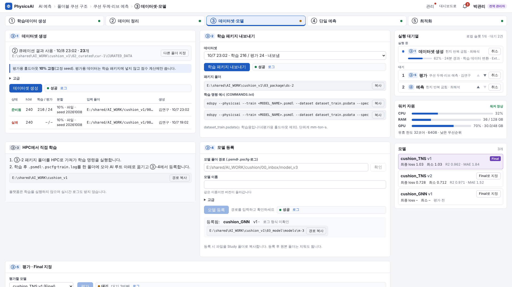
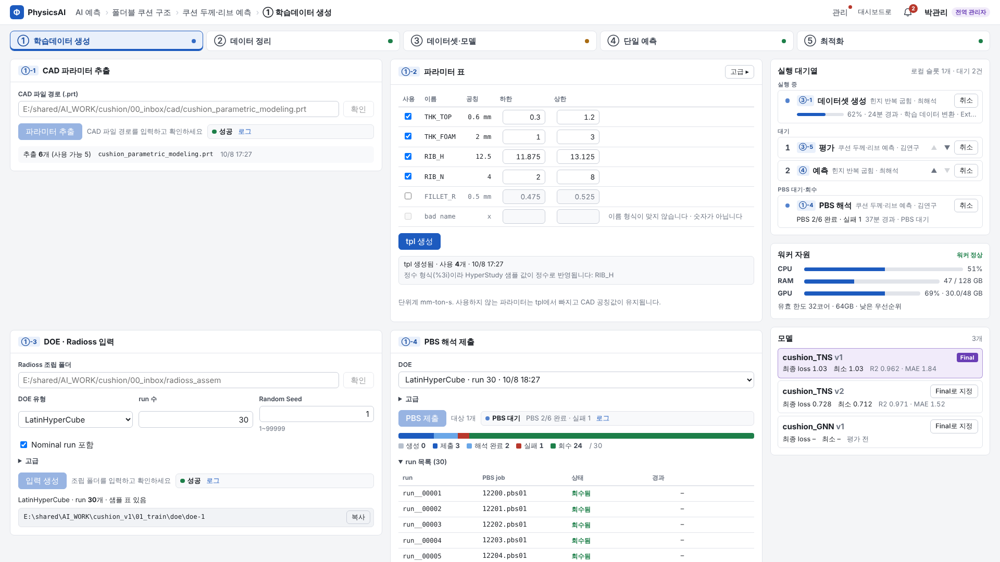
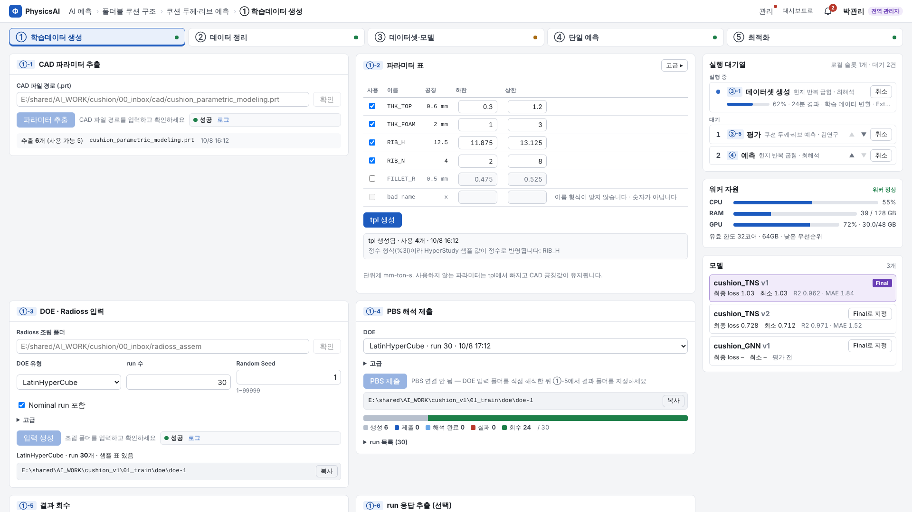
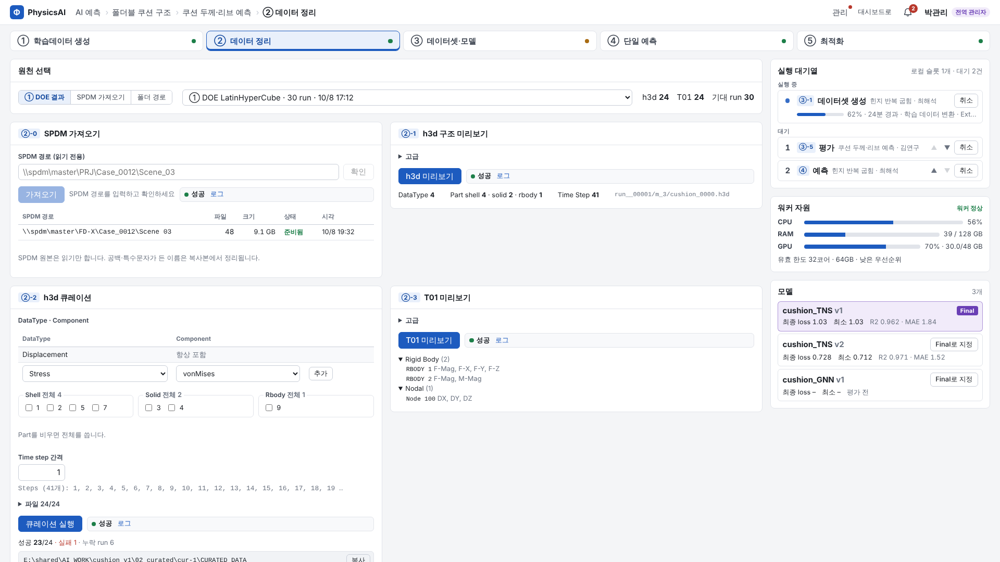
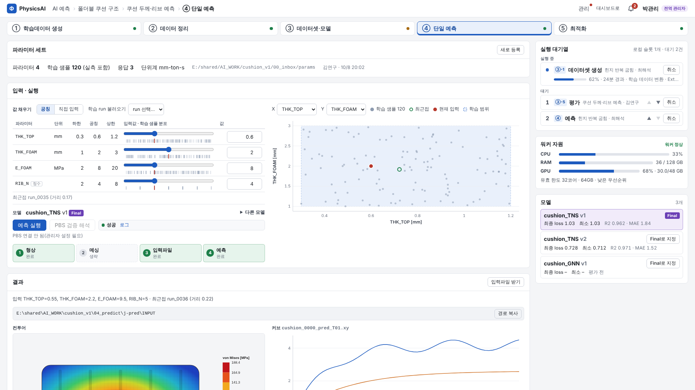
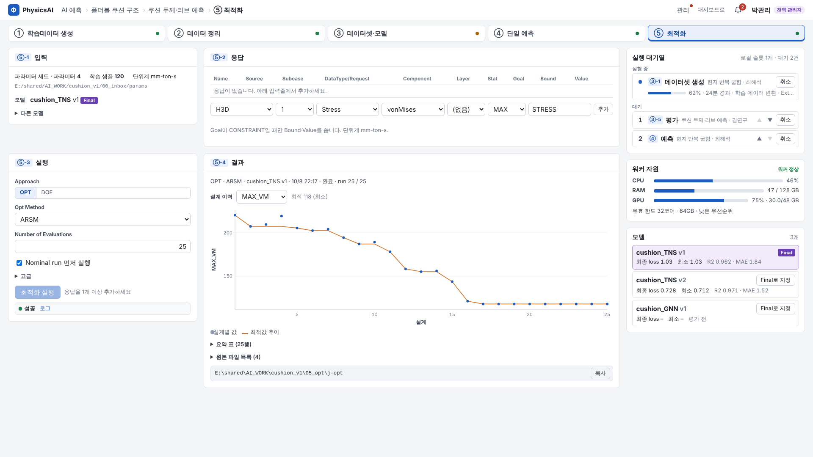

# PhysicsAI 플랫폼 사용자 매뉴얼

- 대상: 해석 엔지니어(대시보드 사용자)
- 기준: 2026-10-09 화면. 설치·설정·문제 해결은 [관리자 매뉴얼](admin.md)을 본다.
- 단위계: **mm-ton-s**(길이 mm, 질량 ton, 시간 s, 응력 MPa, 힘 N, 에너지 mJ, 밀도 ton/mm³). 플랫폼은 단위를 **변환하지 않는다**. 표·축의 단위는 파라미터 세트에 적힌 문자열을 그대로 보여 준다.

## 1. 무엇을 하는 플랫폼인가

Altair PhysicsAI(edspy)로 **해석 대리모델**을 만들고 쓰는 5단계를 웹에서 진행한다.

| 단계 | 하는 일 | 결과 |
|---|---|---|
| ① 학습데이터 생성 | CAD 파라미터 추출 → 파라미터 범위 지정 → DOE·Radioss 입력 생성 → PBS 해석(또는 직접 해석) → 결과 회수 | run별 h3d·T01 |
| ② 데이터 정리 | h3d·T01 구조 미리보기 → 필요한 성분·Part·시간만 남기기(큐레이션), 곡선 추출, SPDM 결과 가져오기 | 학습용 h3d |
| ③ 데이터셋·모델 | 데이터셋 생성(10% 평가용 분리) → 학습 패키지 → **HPC에서 직접 학습** → 모델 등록 → 평가 → Final 지정 | 모델(.psmdl) |
| ④ 단일 예측 | 파라미터 값 입력 → 형상 갱신·메싱·입력 조립·예측 | 컨투어·커브·응답값 표 |
| ⑤ 최적화 | HyperStudy + PhysicsAI 모델로 최적화/DOE | 설계 이력·요약 |

모든 입력은 **서버 폴더 경로**로 지정한다(파일 업로드 없음). 산출물은 서버의 AI 루트 아래 Study 폴더에만 생긴다. SPDM 원본에는 아무것도 쓰지 않는다.

## 2. 시작하기

1. **대시보드에 로그인**한다. 같은 주소의 `/physicsai/`로 들어가면 로그인 없이 내 이름·역할이 보인다(로그인이 안 되어 있으면 "대시보드에서 로그인하세요" 안내가 나온다. 로그아웃도 대시보드에서 한다).
2. **프로젝트 선택**: 대시보드 프로젝트 목록과 내 역할이 보인다.
3. **Study 선택 또는 "새 Study"**(power 이상):
   - 폴더 이름: 영문·숫자·`_`·`-` 64자 이내, 첫 글자 영문·숫자, **생성 후 변경 불가**. AI 루트 아래에 같은 이름 폴더가 생긴다.
   - 제목: 자유(한글 가능).
4. Study 화면은 기본으로 ③ 단계가 열린다. 위 스텝퍼에서 단계를 고른다.

### 2.1 권한

| 내 역할(프로젝트) | 할 수 있는 일 |
|---|---|
| 누구나(로그인한 사용자, 프로젝트 멤버가 아니어도) | 모든 화면·로그·결과 **조회** |
| `power`, `admin` | **실행**: Study 생성, 작업 등록(각 카드의 실행 버튼), 파라미터 세트 등록, Final 지정, 오류 묶음 받기(자기 작업) |
| 전역 관리자 | 대기열 **순서 변경·취소**, 남의 작업 오류 묶음, "관리 > 환경 점검" |

- 실행 권한이 없으면 버튼이 회색이고 마우스를 올리면 "실행 권한(power 이상)이 필요합니다"가 보인다.
- **자기 작업도 직접 취소할 수 없다.** 잘못 등록했으면 전역 관리자에게 취소를 요청한다.
- 대시보드에서 역할이 바뀌면 최대 30초 뒤 반영된다.

## 3. 화면 구성



| 영역 | 내용 |
|---|---|
| **경로바**(왼쪽 위) | `AI 예측 › 프로젝트 › Study › 단계`. 각 항목을 누르면 그 화면으로 |
| **상단 오른쪽** | "대시보드로" 링크, **알림 벨**(미읽음 수), 내 이름·역할. 전역 관리자에게만 "관리" 메뉴 |
| **스텝퍼** | ① 학습데이터 생성 ② 데이터 정리 ③ 데이터셋·모델 ④ 단일 예측 ⑤ 최적화. 오른쪽 점 = 그 단계 최근 작업 상태(파랑 실행 · 주황 대기 · 녹색 성공 · 빨강 실패) |
| **작업영역**(왼쪽) | 하위 단계마다 카드 1개. 카드 머리의 `③-1` 같은 번호가 하위 단계. **주 실행 버튼은 카드당 1개**, 선택 입력은 "고급"(접힘)에 있다 |
| **우측 패널** | ① **실행 대기열**: 실행 중 1건(진행률·경과·현재 단계), 대기 순번·등록자·Study, PBS 대기·회수 중 작업("PBS 2/6 완료 · 실패 1"). 내 작업은 강조 ② **워커 자원**: CPU·RAM·GPU 사용률, 유효 한도("32코어 · 64GB · 낮은 우선순위"), 워커 오프라인 경고 ③ **모델**: 현재 Study 모델, Final 배지, 최종/최소 loss, 평가 점수, "Final로 지정" |
| **토스트**(오른쪽 아래) | 내 작업 시작·완료·실패·다음 차례 알림. 5초 뒤 사라지고, 누르면 그 작업 화면으로 |

### 3.1 실행 버튼과 작업 상태

- 버튼을 누르면 작업이 **대기열에 등록**되고 버튼 옆에 상태가 보인다: `대기 2번째` → 진행률(모르면 움직이는 막대 + 마지막 로그 줄) → `성공`/`실패` + **로그** 링크.
- Altair 프로그램을 쓰는 작업은 **서버 전체에서 한 번에 1개**만 실행된다(먼저 등록한 순서). 파일 복사·검증만 하는 작업(학습 패키지, 모델 등록, 결과 가져오기, SPDM 가져오기)은 따로 1개씩 바로 돈다.
- 같은 Study에서 같은 종류의 작업이 이미 대기·실행 중이면 새로 등록할 수 없다("같은 작업이 진행 중").
- **실행 시간 제한은 없다.** 오래 걸리면 로그의 마지막 줄로 진행을 확인한다.
- 실패하면 원인을 고친 뒤 **같은 버튼을 다시 누른다**(새 작업으로 처음부터 실행). 기존 산출물은 지워지지 않고 `<Study>/_backup/<시각>_<작업id>/`로 옮겨진다.

### 3.2 경로 입력

- 경로 칸에 서버 기준 **절대경로**를 붙여 넣고 **"확인"**을 누르면 개수·형식 요약이 나온다. 확인이 통과해야 실행 버튼이 켜진다.
- 경로 규칙: AI 루트(예 `E:\shared\AI_WORK`) 하위, **공백과 `& | < > ^ % ! "` 금지**, 링크·`..` 금지. 모델·CAD·결과 폴더는 관리자가 허용한 다른 루트도 가능.
- 권장 위치: `<AI 루트>\<Study 폴더>\00_inbox\` 아래에 h3d·모델·파라미터 폴더를 둔다.
- 화면의 회색 경로 상자(예 패키지 폴더, 예측 INPUT 폴더) 옆 **"복사"**는 탐색기에 붙여 넣을 수 있는 경로다.

### 3.3 알림

- **벨**: 미읽음 수(99+까지). 누르면 최근 30일 이력(최신순), 항목을 누르면 읽음 처리 후 그 작업으로 이동, "모두 읽음".
- 받는 알림: 내 작업 시작·완료·실패·취소·중단(워커 중단), **다음 차례입니다**(대기 1번이 됨), PBS 결과 회수 완료, PBS 일부 실패, PBS 취소 실패(관리자 처리 중).
- 페이지를 연 뒤 새로 생긴 알림만 토스트로 뜬다. 탭을 숨기면 갱신을 멈추고 돌아오면 바로 갱신한다.

### 3.4 "관리자 설정 필요"

카드 버튼이 회색이고 "관리자 설정 필요: resources.pyd_dir, …"가 보이면, 그 기능에 필요한 Altair 경로·원본 자원·명령이 서버에 아직 설정되지 않은 것이다. 표시된 키 이름을 그대로 관리자에게 전달한다.

---

## 4. ① 학습데이터 생성



| 카드 | 입력 | 버튼 | 결과 |
|---|---|---|---|
| ①-1 CAD 파라미터 추출 | CAD 파일 경로(`.prt`) + 확인 | **파라미터 추출** | 추출 개수(사용 가능 개수), CAD 이름·시각. SimLab이 CAD의 파라미터 이름·공칭값을 읽는다 |
| ①-2 파라미터 표 | 행마다 **사용**(체크)·하한·상한. 고급: 형식(기본 `%3i`)·단위 | **tpl 생성** | "tpl 생성됨 · 사용 n개 · 시각", 경고 문구 |
| ①-3 DOE · Radioss 입력 | Radioss 조립 폴더 + 확인(starter 표시), DOE 유형, run 수, 유형별 옵션. 고급: 동시 실행 수 | **입력 생성** | run 수, 샘플 표 상태, DOE 폴더 경로 |
| ①-4 PBS 해석 제출 | DOE 선택. 고급: queue·ncpus·walltime, 일부 실패 시 동작 | **PBS 제출** | run 상태 막대(생성·제출·해석 완료·실패·회수), "run 목록" |
| ①-5 결과 회수 | 자동 회수 상태. 수동: 결과 폴더 경로 + 확인(매칭 run 수) | **결과 가져오기** | 회수 n/전체, 누락 run 목록 |
| ①-6 run 응답 추출(선택) | 응답 정의(이름·단위·spec) | **run 응답 추출** | 추출 run 수 |

순서와 요령
1. **①-1**: CAD 경로를 넣고 확인 → 파라미터 추출. 진행률은 SimLab 로그 표식으로 오른다.
2. **①-2**: 쓸 파라미터만 체크하고 하한·상한을 정한다. 기본 범위는 공칭 ±5%. 이름 형식이 맞지 않거나 공칭이 숫자가 아닌 행은 쓸 수 없다(행 끝 회색 문구).
   - **사용하지 않는 파라미터는 tpl에서 빠지고 CAD 공칭값이 유지된다**(미확인 가정, 현장 확인 대상).
   - 형식 `%3i`는 **정수**로 반영된다. 하한·상한·공칭에 소수가 있으면 "정수 형식이라 HyperStudy 샘플 값이 정수로 반영됩니다" 경고가 나온다. 실수 파라미터(두께 등)는 고급에서 형식을 `%6.3f`처럼 바꾼다.
   - "tpl 생성"을 누르면 표 저장 → tpl 생성 순서로 진행한다. 생성 후 표를 바꾸면 "표가 바뀌었습니다 — tpl을 다시 생성하세요"가 뜨고, 다시 생성해야 ①-3을 실행할 수 있다.
3. **①-3**: Radioss 조립 폴더(`*.rad`·`*.inc`, starter `*_0000.rad` 정확히 1개 — 이름이 `eps_mesh`로 시작하는 파일은 제외하고 셈)를 지정한다. 조립 폴더는 Study로 **복사**한 사본을 쓴다. DOE 유형에 따라 run 수를 HyperStudy가 정하는 경우("자동 계산")가 있다. 동시 실행 수를 올리면 빨라지지만 서버 자원 한도 안에서 나눠 쓴다.
   - 샘플 표 상태: `PARSED`(run별 파라미터 값 확보) / `PARTIAL`(일부 run 없음) / `MISSING`(없음 — ④ "① 결과로 만들기"를 쓸 수 없음).
4. **①-4 PBS 제출**: run마다 PBS job으로 제출한다. 제출 후에는 로컬 실행 순서를 다른 사람에게 넘겨주고(대기열에서 "PBS 대기"), 끝나면 결과를 자동 회수한다. 일부 run이 실패하면 기본은 **성공한 run만 회수**하고 알림을 준다. 실패 run은 다시 "PBS 제출"하면 실패·미회수 run만 다시 나간다.
   - **PBS가 연결되지 않은 서버**에서는 버튼이 비활성이고 "PBS 연결 안 됨 — DOE 입력 폴더를 직접 해석한 뒤 ①-5에서 결과 폴더를 지정하세요"가 보인다.

     
5. **①-5 결과 가져오기**(직접 해석했을 때): 결과 폴더 아래(깊이 3까지)에서 이름이 run 이름(`run__00001` 등)인 폴더를 찾아 h3d·T01·out 파일을 Study로 복사한다. 같은 run 폴더가 두 개 이상이면 그 run은 건너뛴다.
6. **①-6**(선택): 응답 추출 명령이 서버에 설정된 경우에만 쓴다. run별 응답값을 만들어 ④ 응답 표의 "최근접 실측" 열에 쓰인다.

다음 단계: 회수한 결과는 **② 데이터 정리의 원천**으로, 파라미터·샘플은 **④ "① 결과로 만들기"**에 쓰인다.

## 5. ② 데이터 정리



먼저 위의 **원천 선택**에서 하나를 고른다: ① DOE 결과(목록) / SPDM 가져오기(목록) / 폴더 경로(확인). 선택한 원천의 h3d·T01 개수와 기대 run 수가 보인다.

| 카드 | 입력 | 버튼 | 결과 |
|---|---|---|---|
| ②-0 SPDM 가져오기 | SPDM 경로(읽기 전용) + 확인(개수·총량·이름 정리 수) | **가져오기** | 가져오기 목록 |
| ②-1 h3d 구조 미리보기 | 고급: 대표 파일 | **h3d 미리보기** | DataType 수, Part 수(shell/solid/rbody), Time Step 수 |
| ②-2 h3d 큐레이션 | DataType·Component 추가, Part 선택, Time step 간격, 파일 목록 체크 | **큐레이션 실행** | 성공 n/전체, 실패 파일·누락 run, 출력 폴더 |
| ②-3 T01 미리보기 | 고급: 대표 파일 | **T01 미리보기** | Type/Request/Component 트리 |
| ②-4 T01 곡선 추출 | Type → Request → Component로 곡선 추가, 파일 체크 | **곡선 추출** | 출력 파일 수, 첫 곡선 미리보기 |

요령
- **SPDM 가져오기**: SPDM 원본은 읽기만 하고 Study의 `02_import`로 **복사**한다. 공백·특수문자가 든 이름은 복사본에서 `_`로 바뀐다. 대시보드에서 "AI 학습 데이터로 보내기" 링크로 들어와도 자동으로 실행되지 않는다 — 프로젝트·Study를 고르고 "가져오기"를 눌러야 한다.
- **큐레이션 전에 ②-1 미리보기가 필요**하다. Component 콤보에는 큐레이션에 쓸 수 있는 것만 나온다. **Displacement는 항상 포함**된다. Part를 하나도 고르지 않으면 전체를 쓴다. Time step 간격 아래에 실제로 남는 step 번호가 미리 보인다.
- 큐레이션은 파일마다 순서대로 실행하고, 일부 파일이 실패해도 나머지는 계속한다(결과에 실패 수 표시).
- 곡선 미리보기는 형식을 알 수 있으면 그래프로, 아니면 JSON 트리("곡선 형식 미확인")로 보인다.

다음 단계: 큐레이션이 끝나면 ③-1의 기본 입력이 **최근 큐레이션 결과**로 채워진다.

## 6. ③ 데이터셋·모델

(화면은 §3의 그림)

| 카드 | 입력 | 버튼 | 결과 |
|---|---|---|---|
| ③-1 데이터셋 생성 | h3d 폴더 경로 + 확인(h3d n개, 학습 m / 평가 k 예상). 큐레이션이 있으면 기본값 "② 큐레이션 결과 사용". 고급: 홀드아웃 비율, seed, 분할 단위, 추출 옵션 | **데이터셋 생성** | 데이터셋 목록(상태, h3d·학습/평가 개수, 생성자·시각) |
| ③-2 학습 패키지 내보내기 | 데이터셋(기본 최신) | **학습 패키지 내보내기** | 패키지 폴더 경로, 학습 명령 예시(복사) |
| ③-3 HPC에서 직접 학습 | 없음(안내) | – | – |
| ③-4 모델 등록 | 모델 폴더 경로 + 확인(psmdl·pscfg·로그 후보), 모델 이름. 고급: 표시명, 데이터셋, 로그 파일 | **모델 등록** | 등록 결과(로그 상태), 저장 경로 |
| ③-5 평가 · Final 지정 | 평가할 모델 | **평가** | 모델 표(이름·버전, 데이터셋, epoch, 최종·최소 loss, 평가 점수, 로그 상태), loss 곡선(선형/로그), Final 지정 |

### 6.1 데이터셋(③-1)

- 폴더 아래 모든 `*.h3d`를 모아 **평가용 10%를 고정 seed로 떼어 둔다**. 평가용은 학습 패키지에 넣지 않고 점수 계산에만 쓴다. 같은 seed로 다시 만들면 같은 분할이 나온다.
- 한 run에 h3d가 여러 개이면 고급의 분할 단위를 **상위 폴더**로 바꾼다(같은 run의 파일이 학습·평가로 나뉘지 않게).
- 평가용은 최소 1개. 데이터가 적으면 점수의 대표성이 낮다.

### 6.2 HPC 학습과 모델 등록(③-2 → ③-3 → ③-4)

플랫폼은 **학습을 실행하지 않는다**. 학습은 HPC에서 직접 하고, 끝난 모델 폴더를 등록한다. 실시간 학습 로그도 받지 않는다.

1. **③-2 학습 패키지 내보내기** → 패키지 폴더(`<Study>\03_package\<데이터셋id>\`)가 생긴다.
   - `dataset_train.psdata`(학습용, 평가용 제외), `COMMANDS.txt`(학습 명령 예시), `REGISTER_README.txt`(등록 폴더 형식).
2. 패키지 폴더를 HPC로 가져가 **본인이 준비한 학습 설정 `.pscfg`**로 학습한다(플랫폼은 pscfg를 만들지도, 열지도 않는다).

   ```text
   edspy --physicsai --train <MODEL_NAME>.psmdl --dataset dataset_train.psdata --spec <SETTINGS>.pscfg > train.log 2>&1
   # 전이학습
   edspy --physicsai --train <MODEL_NAME>.psmdl --dataset dataset_train.psdata --spec <SETTINGS>.pscfg --pretrained-model <PRETRAINED>.psmdl > train.log 2>&1
   ```
3. 학습이 끝나면 **`.psmdl` 1개, 사용한 `.pscfg` 1개, `train.log`**를 한 폴더에 모아 AI 루트 아래(예 `<Study>\00_inbox\model_v3\`)로 옮긴다. 폴더 **바로 아래**(하위 폴더 아님)에 둔다.
4. **③-4 모델 등록**: 폴더 경로 → 확인 → 이름(기본 = psmdl 파일 이름, 영문으로 시작·영문·숫자·`_` 64자) → 모델 등록.
   - `.psmdl`·`.pscfg`가 각각 정확히 1개여야 한다. 로그(`*.log`, `*.txt`)가 2개 이상이면 고급에서 하나를 고른다. 로그가 없어도 등록된다("로그 없음").
   - 같은 이름으로 다시 등록하면 **버전이 올라간다**(v1, v2…).
   - 등록 시 파일을 Study 폴더로 **복사**하므로 등록 후 원본 폴더는 지워도 된다.
   - loss 곡선은 로그의 `epoch=   1/1500  loss=1.03956e+02` 형식 줄에서 읽는다. 형식이 다르면 "로그 형식 미확인"으로 표시되고 등록은 정상이다(관리자에게 로그 몇 줄을 전달하면 파서를 추가할 수 있다).
   - 학습 데이터셋은 기본으로 Study의 최신 데이터셋이 연결된다. 다른 데이터셋으로 학습했다면 고급에서 고른다(평가는 그 데이터셋의 평가용으로 한다).

### 6.3 평가와 Final 지정(③-5)

- **평가**: 모델이 학습한 데이터셋의 **평가용(홀드아웃)** 데이터로 점수를 계산한다(서버 GPU). 점수 형식을 아직 모르면 "점수 형식 미확인".
- **Final 모델**: Study당 1개. ④ 단일 예측·⑤ 최적화의 기본 모델이다. 우측 "모델" 패널이나 ③-5 표에서 "Final로 지정". 평가 전에도 지정할 수 있다("평가 전" 표시). 다시 지정하면 바뀐다.
- 모델 파일이 등록 후 바뀌면(sha256 불일치) 그 모델은 `INVALID`가 되고 평가·예측이 실패한다. 다시 등록한다.

## 7. ④ 단일 예측



### 7.1 파라미터 세트

예측에 쓸 파라미터 정의·학습 샘플·형상 입력 묶음. 방법 두 가지(카드 오른쪽 "등록 방식"):

- **① 결과로 만들기**: ① DOE를 고르고 대상 run(회수된 run(기본)/전체)을 고른다. 파라미터 정의·샘플 값·CAD·tpl·조립 폴더를 자동으로 묶는다(샘플 표가 없으면 불가).
- **폴더 등록**: 아래 구성의 폴더 경로(AI 루트 하위)를 지정한다.

| 파일(폴더 바로 아래) | 필수 | 내용 |
|---|---|---|
| `parameters.json` 또는 `parameters.csv` | 필수 | 파라미터 `name, nominal, min, max, unit`. JSON: `{"schema_version":1, "unit_system":"mm-ton-s", "parameters":[{"name":"THK_1","nominal":3.0,"min":2.0,"max":5.0,"unit":"mm"}]}` |
| `samples.csv` | 선택 | 학습 run별 값. 헤더 `run_key,<모든 파라미터 이름>[,resp:<응답 이름>…]`. 없으면 최근접 run·실측 열 없음 |
| `responses.json` | 선택 | 응답 정의 `{"responses":[{"name":"MaxStress","unit":"MPa","spec":{…}}]}`. 없으면 응답 표 없음 |
| `cad/` | 필수 | CAD 파일 정확히 1개 |
| `simlab_parametered_mesh.tpl` | 필수 | 학습 데이터를 만들 때 쓴 SimLab 템플릿. tpl의 파라미터 이름 = parameters 이름 |
| `radioss_assem/` | 필수 | `*.rad`·`*.inc`, starter(`*_0000.rad`) 정확히 1개 |

이름 규칙: 파라미터·응답 이름은 영문 또는 `_`로 시작, 영문·숫자·`_` 64자. `min ≤ nominal ≤ max`. 새로 등록한 세트가 현재 세트가 된다.

### 7.2 입력값

- 표: 파라미터·단위·하한·공칭·상한·입력값(슬라이더 + 숫자). 슬라이더 아래 눈금은 학습 샘플 분포.
- **값 채우기** 3가지: **공칭** / **직접 입력** / **학습 run 불러오기**(run 선택).
- 오른쪽 산점도: 고른 두 파라미터(X·Y) 평면에서 학습 샘플(회색), 최근접 run(녹색 원), 현재 입력(빨강), 학습 범위(점선 사각형).
- 정수 형식(`정수` 표시) 파라미터는 입력 파일에 **정수로 반올림되어** 들어간다. 소수를 넣으면 "정수 파라미터는 반올림해 반영됩니다: RIB_N 4.6 → 5" 같은 문구가 나온다.

### 7.3 표 아래 회색 참고 문구의 뜻

입력을 바꾸면 표 아래에 한 줄이 나온다. **경고가 아니라 참고**이고 실행을 막지 않는다.

| 문구 | 뜻 |
|---|---|
| `최근접 run_0035 (거리 0.17)` | 모든 값이 학습 범위 안. 학습 샘플 중 입력과 가장 가까운 run과 그 거리(각 파라미터를 `(값 차이)/(상한−하한)`으로 정규화한 거리) |
| `학습 범위 밖 · 최근접 run_0035` | 하나 이상의 값이 [하한, 상한] 밖 |

- PhysicsAI 모델은 파라미터 값이 아니라 **형상(메시)과 해석 결과로 학습한 모델**이다. 그래서 파라미터 범위는 "학습한 형상과 비슷한가"를 가늠하는 **근사 지표**일 뿐이다. 범위 안이어도 형상이 크게 달라지면(위상 변화 등) 예측이 나쁠 수 있고, 범위를 조금 벗어나도 형상이 학습 형상과 비슷하면 쓸 만할 수 있다.
- 그래서 빨간 표시나 배지 없이 문구만 보여 준다. 판단에 도움이 되도록 **최근접 run의 실측값**을 결과 응답 표에 함께 보여 준다(§7.5).

### 7.4 모델·실행

- 모델: 기본은 **Final 모델**(Final이 없으면 실행할 수 없다). 다른 모델은 "다른 모델"(고급)에서 고른다.
- **예측 실행** → 4단계 진행 표시: ① 형상(tpl에 값 반영 → SimLab 형상 갱신) ② 메싱(설정에 따라 "생략" — 형상 단계에서 함께 수행) ③ 입력파일(Radioss 입력 조립) ④ 예측(edspy).
- **PBS 검증 해석**: 예측 입력을 PBS로 실제 해석해 응답 표에 "PBS 검증" 열을 붙인다. PBS가 연결되지 않은 서버에서는 비활성("PBS 연결 안 됨").

### 7.5 결과

| 영역 | 내용 |
|---|---|
| 입력 요약 | 실제 반영 값(정수 반영 포함)과 최근접 run |
| **입력파일 받기** | 조립된 Radioss 입력(`INPUT` 폴더의 .rad·.inc)을 zip으로 내려받기. INPUT 폴더 경로 복사도 있다 — 직접 해석·확인용 |
| 컨투어 | 미리보기 이미지가 있으면 이미지, 없으면 결과 목록(subcase·datatype) 트리와 "컨투어 이미지 없음 — 미리보기 TCL 출력은 결과 목록입니다" |
| 커브 | 예측 결과에 곡선(`.xy`)이 있을 때만 |
| 응답값 표 | 응답·단위·**예측**·**최근접 실측**(최근접 run의 샘플 실측값)·**차이%**·(PBS 검증). 예측 열이 "추출 미구성"이면 응답 추출 명령이 아직 서버에 설정되지 않은 것 |

예측 h3d는 `<Study>\04_predict\<작업id>\RESULT\<starter>_pred.h3d`에 있다. HyperView로 열 때 단위는 mm-ton-s(응력 MPa, 변위 mm)다.

## 8. ⑤ 최적화



| 카드 | 내용 |
|---|---|
| ⑤-1 입력 | 현재 파라미터 세트 요약, 모델(기본 Final, "다른 모델"). Final이 없으면 "Final 모델을 먼저 지정하세요" |
| ⑤-2 응답 | 표: Name · Source · Subcase · DataType/Request · Component · Layer · Stat · Goal · Bound · Value. 아래 입력줄에서 Source(H3D/XYDATA) → Subcase → DataType → Component/Layer → Stat → Name(기본 제안) → "추가" |
| ⑤-3 실행 | Approach(OPT/DOE), Opt Method(ARSM/GRSM/SQP), Number of Evaluations(SQP는 Maximum Iterations), "Nominal run 먼저 실행". 고급: Study 폴더 이름, 수렴 기준, On Failed Evaluation. 버튼 **최적화 실행**/**DOE 실행** |
| ⑤-4 결과 | 진행 "run 12 / 25 시작"(DOE는 "run 12 시작"), 완료 후 설계 이력 그래프·요약 표(형식을 알 수 있을 때) 또는 "결과 요약 형식 미확인 — 원본 파일 목록을 확인하세요" + 파일 목록(CSV·텍스트는 눌러서 보기), 폴더 경로 |

요령
- 응답 콤보 후보는 **④에서 예측을 한 번 실행하면** 채워진다. 없으면 직접 입력할 수 있다.
- Goal이 `CONSTRAINT`일 때만 Bound(`<=`·`>=`·`==`)·Value를 쓴다. OPT는 MINIMIZE/MAXIMIZE 목적이 1개 이상 필요하다.
- 이름 칸에 `|`, 따옴표, 중괄호 등 특수문자는 쓸 수 없다.
- 메서드를 바꾸면 Number of Evaluations·수렴 기준 기본값이 원본 앱과 같게 채워진다.

## 9. Study 폴더 구조(참고)

```text
<AI 루트>\<Study 폴더>\
  00_inbox\            사용자가 h3d·모델·파라미터 폴더를 두는 권장 위치(플랫폼은 읽기만)
  01_train\            ① CAD·파라미터·tpl·DOE·결과(results\<doe>\<run>\)
  02_import\ 02_preview\ 02_curated\   ② SPDM 사본·미리보기·큐레이션 결과(CURATED_DATA\)
  03_dataset\ 03_package\ 03_model\    ③ 데이터셋·학습 패키지·모델 사본·평가 결과
  04_params\ 04_predict\               ④ 파라미터 세트 사본·예측 작업(INPUT\, RESULT\)
  05_opt\              ⑤ 최적화 작업 폴더
  logs\<작업id>\       작업·단계 로그
  _backup\             덮어쓰기 전에 옮겨 둔 이전 산출물(자동 삭제 없음)
```

`00_inbox` 외의 산출 폴더(`03_dataset` 등)는 입력 경로로 지정할 수 없다(③-1은 ① 결과·② 큐레이션·SPDM 사본 폴더는 허용).

## 9-1. 시연 모드로 써보기

Altair가 없는 PC에서도 화면과 흐름을 연습할 수 있다(가짜 도구가 결과를 흉내 냄).

1. 관리자에게 받은 묶음(또는 저장소)에서 `deploy\demo\start-demo.bat`를 더블클릭한다(관리자 권한 불필요).
2. 브라우저가 `http://127.0.0.1:8190/`을 연다 → 시연 사용자 **admin / power / general** 중 하나를 고른다(역할별로 버튼이 어떻게 달라지는지 볼 수 있다).
3. 이미 만들어진 Study **"시연 브래킷 낙하"**에서 ①부터 진행한다. 입력 파일은 그 Study의 `00_inbox`에 있다.
   - PBS가 없으니 ①-4 대신 **①-5 결과 가져오기**에 `<시연 폴더>\import\hpc_results`를 넣는다(기본 시연 폴더 `C:\physicsai-demo`).
   - ③-4 모델 등록 폴더는 `<시연 폴더>\import\trained_model`.
4. 끝나면 `deploy\demo\stop-demo.bat`. 만든 파일은 지워지지 않는다.

시연 결과(컨투어·점수 등)는 가짜 값이다. 실제 판단에 쓰지 않는다.

## 10. 자주 묻는 질문

**Q. "확인"을 누르면 경로가 거부된다.**
AI 루트 밖이거나, 경로에 공백·`& | < > ^ % ! "`가 있거나, 링크·`_backup`·산출 폴더 안이다. 폴더를 `<Study>\00_inbox\` 아래로 옮기고 이름에서 공백·특수문자를 뺀다(SPDM 경로만 공백·한글 허용).

**Q. 버튼이 회색이다.**
① 실행 권한이 없다(툴팁 "실행 권한(power 이상)…") ② "관리자 설정 필요"가 보인다(§3.4) ③ 경로 확인을 안 했다 ④ 같은 종류 작업이 진행 중이다 ⑤ 앞 단계가 안 끝났다(예: ⑤는 Final 모델 필요, ①-3은 tpl 필요, ②-2는 미리보기 필요).

**Q. 내 작업이 계속 "대기 n번째"다.**
Altair 작업은 서버 전체에서 한 번에 1개만 돈다. 우측 대기열에서 앞 작업을 확인한다. 1번이 되면 "다음 차례입니다" 알림이 온다. 급하면 전역 관리자에게 순서 변경을 요청한다.

**Q. 작업을 취소하고 싶다.**
사용자는 취소할 수 없다. 전역 관리자에게 요청한다(대기 중이면 즉시, 실행 중이면 수 초 안에 프로세스가 정리된다).

**Q. 작업이 실패했다.**
상태 옆 **로그**를 열어 마지막 부분을 본다. 원인을 모르겠으면 **"오류 묶음 받기"**(내 작업·관리자만 보임)로 zip을 받아 관리자에게 보낸다. 안에는 로그 꼬리·실행 명령·설정 요약이 들어 있고 비밀번호·토큰은 가려진다. 고친 뒤 같은 버튼을 다시 누른다.

**Q. "워커 중단으로 작업이 멈췄습니다"(INTERRUPTED) 알림이 왔다.**
서버 실행기가 재시작·업데이트되며 작업이 끊긴 것이다. 같은 버튼을 다시 누른다.

**Q. 이전 결과가 사라졌다.**
지우지 않는다. 같은 위치에 다시 만들 때 이전 파일은 `<Study>\_backup\<시각>_<작업id>\`로 옮겨진다.

**Q. 모델 등록 후 loss 곡선이 없다 / "로그 형식 미확인".**
로그 형식이 기본(`epoch=  N/M  loss=X`)과 다르다. 등록은 정상이다. 로그 몇 줄을 관리자에게 보내면 파서를 추가할 수 있고, 추가 후 다시 등록하면 곡선이 생긴다.

**Q. 평가 점수가 "점수 형식 미확인"이다.**
점수 출력 형식이 서버에 아직 설정되지 않았다. 평가 로그의 점수 줄을 관리자에게 전달한다.

**Q. 예측 결과에 컨투어 그림이 없다.**
원본 미리보기 TCL이 그림이 아닌 결과 목록을 만든 경우다. 결과 목록 트리가 대신 보인다. 그림은 HyperView로 예측 h3d를 열어 본다(입력파일 받기·경로 복사 이용).

**Q. 응답 표의 예측 열이 "추출 미구성"이다.**
응답값 추출 명령이 서버에 아직 없다. 최근접 실측 열은 샘플 표로 계속 보인다.

**Q. ④에서 "학습 범위 밖"이 뜨는데 실행해도 되나?**
된다. 참고 문구일 뿐이다(§7.3). 최근접 run의 실측값과 비교하고, 중요하면 "PBS 검증 해석"(연결된 경우)이나 입력파일 받기로 실제 해석을 돌려 확인한다.

**Q. 단위를 바꿔서 쓸 수 있나?**
안 된다. 플랫폼은 mm-ton-s를 가정하고 변환하지 않는다. 해석 모델·파라미터·응답을 모두 mm-ton-s로 맞춘다.

**Q. Study 이름(폴더)을 바꾸고 싶다.**
폴더 이름은 바꿀 수 없다(제목 변경·Study 보관도 현재 화면에는 버튼이 없다 — 필요하면 관리자에게 요청). 새 Study를 만든다.
